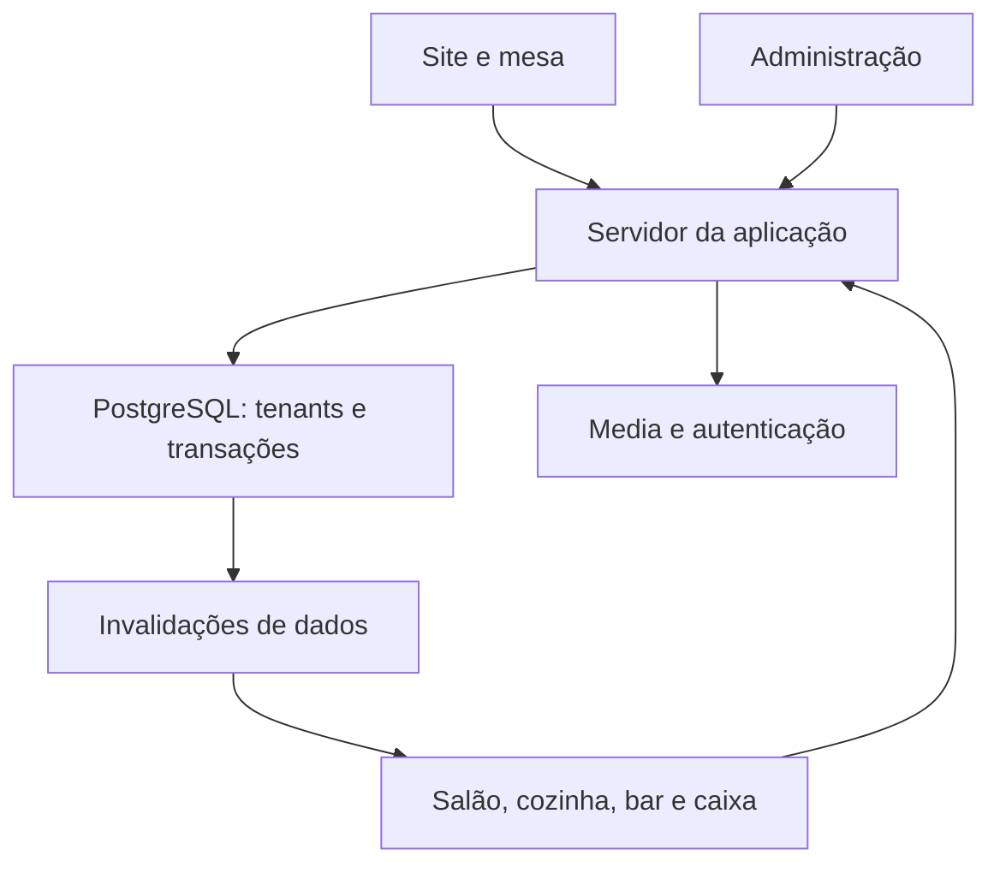
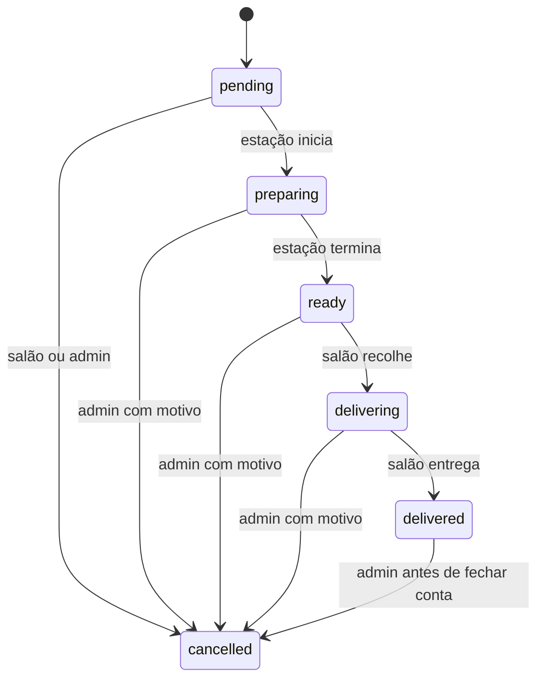

# RESTAURANTE SAAS — Arquitetura de produto da V1

Versão 1.0 · 27 de setembro de 2026 · Contrato de implementação

Este documento fecha UX, dados, permissões, concorrência e direção visual. Não contém uma implementação. Ler em conjunto com o Briefing e o Plano. IDs Dxx referem-se às decisões do Briefing; referências Fxx estão no final. Todos os valores de capacidade e desempenho abaixo são metas de projeto, não benchmarks executados.

## 1. Sistema e fronteiras

Um monólito modular web, uma base PostgreSQL e serviços geridos de autenticação, realtime e media. Quatro superfícies: site público, cliente na mesa, operação e administração. Não existem microserviços, motor de plugins ou repositórios por restaurante.

O navegador nunca determina o preço final, a estação, o restaurante proprietário de um registo ou a permissão. O servidor resolve contexto e identidade; funções transacionais na base validam novamente e gravam estado e histórico de uma vez.

### 1.1 Stack escolhida

| Camada | Escolha | Razão e limite |
|---|---|---|
| Aplicação | Next.js estável, App Router, React e TypeScript estrito | SSR do site e áreas autenticadas no mesmo deploy; rotas reais, metadados e BFF |
| Interface | CSS Modules + CSS custom properties; primitivas Radix só quando úteis | Design próprio; sem template pronto de dashboard ou Tailwind obrigatório |
| Estado remoto | TanStack Query nos painéis/mesa | Cache por tenant/sessão, polling, invalidação e recuperação; não usar cache como verdade |
| Formulários | HTML/React e Zod; React Hook Form apenas formulários administrativos longos | Validação partilhada e erros acessíveis |
| Base e migrations | PostgreSQL do Supabase; migrations SQL e tipos gerados | Transações, constraints, RLS e funções atómicas são centrais; não adicionar Prisma nesta V1 |
| Autenticação | Supabase Auth, `@supabase/ssr` | Contas individuais, cookies de sessão e recuperação; sem senhas próprias |
| Realtime | Supabase Postgres Changes sobre uma tabela de invalidações por utilizador | Eventos mínimos sem dados de pedidos; autorização por destinatário; polling cobre perdas |
| Media | Supabase Storage + variantes WebP/AVIF/JPEG produzidas no upload/build | Assets públicos separados de originais privados; paths com tenant |
| QR | Biblioteca `qrcode`, SVG/PNG gerado a partir da URL | QR exato, testável e imprimível; nunca imagem gerada por IA |
| Testes | Vitest, Playwright, pgTAP/Supabase CLI | Regras puras, browser real, grants/RLS e transações |
| Deploy | Vercel para aplicação, Supabase para serviços | Um projeto por ambiente; domínios por tenant; região próxima e compatível entre serviços |
| Runtime | Node LTS suportado simultaneamente pelo Next e pelo alojamento | Fixar versões exatas e lockfile na fase 0, após verificar compatibilidade |

Não escrever “latest” como estratégia de reprodução. Fixar runtime, gestor de pacotes, CLI e dependências; registar versões resolvidas no README. Não depender de um número de versão futuro presumido. As APIs de auth, permissões e domínio foram verificadas em documentação oficial [F1–F6]; as escolhas de arquitetura são próprias deste projeto.

### 1.2 Modelo de acesso à base

As tabelas de negócio ficam no schema `app_private`, fora dos schemas expostos pela Data API. RLS ligada, sem grants diretos para `anon`/`authenticated`. O schema `public` expõe somente funções RPC explicitamente autorizadas e a tabela mínima `staff_invalidations`.

- `public.site_*`: leitura pública apenas de conteúdo publicado e carta visível; execução para `anon` e `authenticated`; sem dados operacionais.
- `public.staff_*`: leitura/mutação com JWT do utilizador. Cada função identifica `auth.uid()`, confirma membro ativo e permissão no tenant; nunca aceita um `actor_user_id` fornecido pelo cliente.
- `public.guest_*`: execução apenas para `service_role`, chamada pelo servidor da aplicação, que entrega tenant resolvido e segredo da sessão/QR. A própria função verifica esse segredo e a sua associação; conhecer um UUID não permite agir.
- `public.system_*`: apenas `service_role`, para provisionamento, uploads e manutenção. Sem endpoint genérico que permita ao cliente escolher função/SQL.
- Helpers ficam em `app_private`, sem execução pública. A única exceção de execução para `authenticated` é `can_read_invalidation(restaurant_id, member_id)`, usada pela policy de realtime: devolve somente se esse membro ativo pertence a `auth.uid()` e ao tenant ativo. Conceder a permissão necessária de USAGE do schema/EXECUTE dessa função, mantendo zero grants sobre tabelas privadas e mantendo o schema fora da Data API. Não conceder a anon. A função usa SECURITY DEFINER/search_path vazio e nunca devolve dados de outro membro. Revogar `EXECUTE` por defeito de `PUBLIC`, `anon` e `authenticated`; conceder somente a lista prevista.

As RPCs que acedem às tabelas privadas usam `SECURITY DEFINER`, `SET search_path=''`, nomes qualificados, sem SQL dinâmico e com verificações explícitas. O proprietário dessas funções pode ultrapassar RLS: **não afirmar que RLS protege automaticamente o interior da RPC**. A barreira aí é autorização explícita + escopo em todas as queries + FKs compostas + testes negativos. A RLS deny-by-default e a ausência de grants reduzem superfícies acidentais [F1, F2].

Não enviar `service_role` para o browser. O cliente SSR de funcionários usa JWT do utilizador; o cliente privilegiado é separado, marcado `server-only`, e não pode ser importado em módulos UI. Como as RPCs de staff são acessíveis diretamente pela Data API, regras, limites de frequência críticos e permissões têm de estar nelas, não apenas no BFF.

## 2. Multi-tenancy, domínios e navegação

`Restaurant` representa um estabelecimento. Uma marca com duas filiais terá dois tenants na V1. Não há partilha automática de carta, membros ou contas entre eles.

Produção: `{slug}.BASE_DOMAIN` como endereço padrão; domínio próprio verificado opcional. Operação/administração em `app.BASE_DOMAIN/r/{slug}/...`. A autenticação dos funcionários acontece neste host central, evitando partilha de cookies de login entre domínios personalizados.

| Entrada | Resolução |
|---|---|
| Host público padrão ou domínio próprio | Match exato em `restaurant_domains`, verificado e ativo → restaurant_id |
| Host central + `/r/{slug}` | Slug → tenant, seguido de verificação de associação do utilizador |
| Desenvolvimento/preview: `/d/{slug}/...` | Só em host de desenvolvimento/preview permitido; mesmas páginas públicas com basePath explícito |
| Host desconhecido ou tenant suspenso | 404 neutro; não escolher um restaurante por defeito |

Normalizar hostname para minúsculas/punycode e retirar porta no desenvolvimento; aceitar somente hosts configurados. Não confiar em `x-tenant-id` ou `x-forwarded-host` arbitrários. A infraestrutura entrega o host validado; o servidor produz o contexto interno. Paths internos `/internal-sites/{slug}` são reescritas de implementação e são rejeitados se vierem no path original do pedido. O resolver elimina headers de contexto fornecidos pelo browser e cria o contexto interno depois de validar o host; o renderer volta a conferir o tenant. Usar um segmento roteável normal, não uma pasta Next prefixada por underscore.

Queries usam `restaurant_id`; FKs entre entidades tenant usam `(restaurant_id, id)`. Cache pública usa tenant + idioma + versão publicada. Cache privada, páginas de mesa, login e operação: `Cache-Control: private, no-store`. Não colocar `Set-Cookie` em respostas públicas cacheadas [F3]. A primeira V1 pode usar SSR `no-store` também no público para reduzir risco; otimização posterior exige teste de cache cruzado.

Domínio próprio: cadastrar/verificar no alojamento e DNS; só depois marcar ativo na base. Um domínio normalizado é globalmente único. A V1 inclui procedimento manual de operador, não integração automática com API de compra de domínios. Redirecionar aliases públicos para o domínio primário preservando path/query. Não redirecionar o host de operação para o restaurante [F6].

## 3. Arquitetura de páginas

As rotas públicas abaixo são relativas ao domínio do restaurante. No preview, `publicUrl()` acrescenta `/d/{slug}`; nunca concatenar esse prefixo manualmente na UI.

| Rota | Ecrã e conteúdo | Ação central |
|---|---|---|
| `/` | Home, sete blocos do Briefing | Ver a carta / pedir reserva |
| `/carta` | Categorias ancoradas, pesquisa simples, preços e disponibilidade | Abrir produto |
| `/carta/categoria/{slug}` | Listagem da categoria, introdução e breadcrumb | Explorar produtos |
| `/carta/{itemSlug}` | Produto: imagem, descrição, preço, alergénios, disponibilidade | Planear visita; link contextual para a mesa quando houver sessão |
| `/sobre` | Conceito e forma de receber | Ambiente / reserva |
| `/ambiente` | Sala e Pátio, galeria acessível | Pedir reserva |
| `/reservas` | Pedido de data/hora/pessoas e contacto | Enviar pedido; confirmar não significa reservar |
| `/contactos` | Horários, localização e contactos verificados | Abrir mapa externo/telefonar quando configurados |
| `/privacidade` | Comportamento factual e dados/contactos do restaurante | Informação |
| `/mesa/{label}` | Entrada contextual, validação QR/código ou resumo do atendimento | Carta / ajuda |
| `/mesa/{label}/carta` | Carta com adicionar | Adicionar itens |
| `/mesa/{label}/carta/{itemSlug}` | A mesma ficha de produto dentro de TableShell | Quantidade/observações e adicionar ao carrinho |
| `/mesa/{label}/carrinho` | Linhas, quantidades, observações e total | Enviar pedido |
| `/mesa/{label}/pedidos` | Meus envios e consumo partilhado sanitizado | Acompanhar estado |
| `/mesa/{label}/conta` | Consumo, total atual e pedido de conta | Pedir a conta |

A ficha pública e a ficha contextual usam o mesmo ItemDetail e os mesmos dados; apenas contexto, shell e ações diferem. URLs públicas permanecem sem dados privados; “Continuar na Mesa 14” é resolvido por consulta privada no cliente, sem incorporar sessão numa resposta pública cacheada.

Chamados abrem bottom sheet acessível, sem uma página por motivo. “Pedir bebida” abre a categoria de bebidas, nunca cria chamado vago para o bar. “Talheres”, “Preciso de ajuda” e “Chamar equipa” criam chamados de salão.

| Rota no host central | Destino | Acesso |
|---|---|---|
| `/entrar`, `/recuperar`, `/auth/callback`, `/definir-palavra-passe` | Login, convite e recuperação | Conta própria; retornos allowlisted |
| `/restaurantes` | Selecionar entre associações próprias | Membro autenticado |
| `/r/{slug}/op/salao` | Chamados, prontos, contas pedidas e mesas | Salão/admin |
| `/r/{slug}/op/cozinha` | KDS; estação por permissão, não pela query livre | Cozinha/admin |
| `/r/{slug}/op/bar` | KDS da estação Bar | Bar/admin |
| `/r/{slug}/op/caixa` | Contas e recebimentos | Caixa/admin |
| `/r/{slug}/admin` | Resumo operacional | Admin |
| `/r/{slug}/admin/pedidos` | Lista e detalhe em rota `/{id}` | Admin |
| `/r/{slug}/admin/mesas` | Zonas, mesas, QR e atendimentos ativos | Admin |
| `/r/{slug}/admin/carta/produtos` | Produtos, filtros, disponibilidade | Admin |
| `/r/{slug}/admin/carta/categorias` | Ordem e nomes | Admin |
| `/r/{slug}/admin/equipa` | Convites, associação, papéis e desativação | Admin com limites de titularidade |
| `/r/{slug}/admin/estacoes` | Nomes, membros e prazo alvo | Admin |
| `/r/{slug}/admin/chamados` | Histórico e pendências | Admin |
| `/r/{slug}/admin/contas` | Contas e detalhes | Admin |
| `/r/{slug}/admin/reservas` | Caixa de pedidos, confirmação manual | Admin; salão usa bloco da sua operação |
| `/r/{slug}/admin/site` | Conteúdo estruturado, tema, media, preview/publicação | Admin |
| `/r/{slug}/admin/analytics` | Métricas com período e definições | Admin |
| `/r/{slug}/admin/configuracoes` | Serviço, contactos, horários e segurança | Admin; titularidade somente owner |

Produtos/Categorias ficam sob Carta; Analytics fica separado do resumo. “Gestão de pedidos” e “KDS” não são dois motores: são projeções dos mesmos registos. Implementar estados 404, 403, carregamento, vazio, erro e indisponibilidade da rede por área.

### 3.1 URLs, SEO e consulta pública

Slug do restaurante é imutável na V1; nome público continua editável. Slug de produto fica imutável após publicação e slug/label da mesa após emitir o primeiro QR; para substituir uma mesa, arquivar quando livre e criar outra. Reservar slugs de sistema (`categoria`, `mesa`, `api`, `admin`, `op`, `reservas`). Isso evita QR impresso com rótulo diferente da mesa e URLs antigas que passem a mostrar outro recurso.

Gerar title/description e canonical por página/tenant, usando domínio primário verificado; sitemap apenas público e publicado. Demo e preview têm noindex; mesa, Auth, operação e administração sempre noindex e fora de sitemap. Imagem de partilha da ficha vem da sua capa; JSON-LD Restaurant somente com campos factuais configurados, sem reviews, coordenadas, morada ou classificação fictícia. Não incluir contactos nulos ou mapa embutido no demo.

Carta tem pesquisa por nome sem acentos e filtros de categoria; categorias seguem sort_order, produtos sort_order+name. Query `q` limitada a 80 caracteres, estado preservado ao voltar da ficha; sem filtros por alergia que sugiram garantia de segurança. Menu de até 200 produtos na V1 pode ser carregado num DTO público; listas administrativas e históricos usam cursor por `(created_at,id)`, limite padrão 50 e máximo 100. Nunca devolver todos os pedidos históricos ao KDS.

## 4. UX e componentes

### 4.1 Contextos visuais

Público: fotografia grande, títulos editoriais, navegação discreta, sem grelha uniforme de caixas. Carta: linhas com fotografia opcional, nome, descrição curta e preço alinhado; mobile mantém preço e controlo legíveis. Mesa: cabeçalho compacto “Pátio do Ferro · Mesa 14”, sem links que façam perder o atendimento.

Operação: fonte sans, números tabulares, separadores, superfícies sóbrias e estados com texto. Salão começa por tarefas acionáveis; KDS organiza tickets por Novo/Em preparação/Pronto; caixa começa por contas pedidas. Administração usa sidebar desktop, navegação compacta mobile, tabelas que se transformam em listas sem perder campos essenciais.

| Componente | Contrato |
|---|---|
| `RestaurantShell` | Marca, links, tokens, metadados e rodapé por tenant |
| `MenuList` / `MenuItemRow` | Mesmo DTO no público e na mesa; modo de ação muda conforme contexto |
| `ItemDetail` | Imagem, ingredientes/descrição, alergénios, quantidade 1–10 e nota até 160 caracteres |
| `TableShell` | Mesa, estado da ligação, navegação Carta/Pedidos/Ajuda e carrinho |
| `CartBar` | Nº de unidades, total estimado e “Ver pedido”; visível apenas com carrinho não vazio |
| `ServiceCallSheet` | Motivos finitos, chamado atual e estado; sem campo livre inicial |
| `ConnectionBanner` | “A atualizar”, “Sem ligação” ou “Dados atualizados às…”; não esconder erro |
| `StationTicket` | Mesa, código do pedido, linhas/quantidades/notas, tempo; sem preços ou dados do cliente |
| `ReadyQueue` | Linhas agrupadas por mesa, estação e hora; assumir/recolher e entregar |
| `CallQueue` | Prioridade, motivo, tempo e responsável; conflito mostra quem assumiu |
| `TableList` | Mesa livre/em atendimento/a fechar; abrir atendimento ou ver resumo |
| `BillReview` | Linhas, anulados separados, total, pendências e recebimento externo |
| `ContentEditor` | Formulário por secção; preview; guardar rascunho/publicar |
| `DataTable`, `FormField`, `ConfirmDialog`, `EmptyState` | Primitivas acessíveis; texto de erro específico |

### 4.2 Mobile, acessibilidade e performance

Breakpoints de composição: <768 px mobile; 768–1199 tablet; ≥1200 desktop. Testar 360×800, 390×844, 768×1024, 1024×768 e 1440×900. Em 320 px permitir composição reduzida sem scroll horizontal de página. KDS mobile usa separadores de coluna, não três colunas comprimidas.

Alvos internos: 48×48 px cliente/salão; 56 px ações KDS. São decisões de ergonomia superiores ao mínimo geral da WCAG, não uma afirmação de exigência legal universal [F8]. Corpo ≥16 px, texto operacional de item 20–24 px, quantidade 24–28 px. Contraste pretendido 4,5:1 no texto comum e 3:1 em texto grande/componentes; verificar pares reais de tokens.

Ações principais próximas ao polegar; `env(safe-area-inset-bottom)` e padding equivalente no conteúdo. Modais com foco gerido, Escape e retorno; formulários com label e erro associado; avisos em `aria-live` moderado; não anunciar cada segundo dos relógios. Status tem texto e ícone funcional. Reduced motion elimina transições; som precisa de ativação explícita “Ativar som” e não é o único aviso.

Metas: primeira imagem mobile ≤250 KB, desktop ≤500 KB; thumbnails ≤60 KB; dimensões reservadas para evitar saltos; carregamento lazy abaixo da dobra. Site SSR utilizável antes da hidratação; mesa mostra aviso para ativar JavaScript se desativado. LCP pretendido ≤2,5 s e CLS ≤0,1 sob condições documentadas; reportar medições de laboratório e não inventar métricas de campo.

## 5. Estados e invariantes

### 5.1 Atendimento e mesa

`table_visits.status`: `open → billing → closed`. `billing → open` somente caixa/admin, com motivo; reabre novos pedidos e avança o ciclo da conta. Mesa livre = sem visita open/billing; ocupada = open; a fechar = billing. Não persistir também um `table.status` que possa divergir.

Uma mesa só tem uma visita ativa. Abertura e encerramento são transações. Visita com consumos entregues não fecha por abandono, cron ou expiração de token. Mesa vazia pode ser encerrada como conta `void` com motivo; mesa com consumo requer recebimento ou anulação autorizada. Transferir/juntar mesas fica fora da V1.

### 5.2 Linhas de pedido

A linha tem quantidade inteira 1–10, e todas as unidades avançam juntas. Uma linha de dois hambúrgueres só fica pronta quando os dois estiverem prontos; o sistema não pretende acompanhar unidades parciais. Para cozinhas que precisem disso, evolução posterior com unidades/splits; não improvisar uma divisão sem atualizar preços/eventos.

Não recuar estados. Engano de preparação: administrador anula a linha com motivo e cria nova linha por pedido assistido, quando apropriado. Item servido mas anulado antes do fecho mantém histórico e deixa de compor a conta; só admin pode fazê-lo. Depois de settled, nada altera as linhas ou total.

`preparing`/`ready` pertencem exclusivamente à estação gravada na linha. `delivering` regista o membro que recolheu. Outro membro não entrega silenciosamente em nome dele; admin/salão podem reatribuir entrega com motivo e evento. A UI mostra quem está a levar.

Estado do pedido é derivado e somente de leitura:

1. Sem linhas não anuladas → `cancelled`.
2. Todas não anuladas delivered → `delivered`.
3. Alguma delivered/delivering → `partially_served`.
4. Todas restantes ready → `ready`.
5. Alguma ready → `partially_ready`.
6. Alguma preparing → `preparing`.
7. Caso contrário → `new`.

Mostrar progresso por linha; `partially_served` não oculta os itens ainda novos. Não há `accepted`: commit válido é aceitação operacional automática. Uma estação pode avançar todas as linhas elegíveis do seu ticket numa ação atómica; selecionar versões explícitas e não tocar linhas de outra estação.

### 5.3 Tickets de estação

Um `station_ticket` por `(order_id, station_id)`. O ticket contém somente linhas dessa estação. Coluna KDS: Novo se todas ativas pending; Em preparação se alguma pending/preparing e outra já avançou; Pronto se não houver pending/preparing mas houver ready; retirar quando todas delivered/delivering/cancelled. Linhas prontas continuam visíveis no ticket até recolha, ainda que outra linha esteja a preparar. A ReadyQueue consulta linhas ready, não o estado agregado do ticket.

### 5.4 Chamados e reservas

Chamado: `new → claimed → completed`, ou `new/claimed → cancelled` por salão/admin com motivo. Reatribuir mantém claimed, muda responsável e grava evento; não libertar automaticamente quando um browser fecha. Tipos: `service`, `cutlery`, `help`, `bill`. Chamados bill são criados só pelo motor de conta, não pelo endpoint genérico.

Reserva: `pending → confirmed|declined|cancelled`; `confirmed → completed|cancelled|no_show`. Não existe garantia automática de lugar. Mudanças gravam ator, horário e nota interna; o estado “confirmed” indica que a equipa confirmou, não que o software enviou mensagem. O operador confirma contacto feito antes de concluir a confirmação.

### 5.5 Invariantes financeiras

Uma conta por visita: `open → requested → settled`, ou `open/requested → void` se total zero e sem trabalho pendente. `requested → open` por caixa/admin com motivo. `settled` e `void` são terminais.

Pedidos adicionais só em visita open + conta open. Primeiro pedido de conta incrementa request_cycle e cria chamado bill com esse ciclo; chamadas repetidas enquanto a conta continua requested devolvem o mesmo resultado, mesmo se esse chamado já foi concluído. Reabrir a conta conclui/cancela o chamado bill ainda ativo com motivo; o próximo pedido de conta cria um novo ciclo. Pedir conta muda ambos para billing/requested, cria chamado bill deduplicado e impede novos pedidos. Preparação/entrega continuam. A conta pode ser pedida com trabalho pendente; o recebimento só é permitido quando cada linha não anulada estiver delivered e todas as revisões tiverem sido conferidas.

Total = soma de `quantity × unit_price_cents` das linhas não anuladas. EUR inteiro em cêntimos, sem ponto flutuante, taxas adicionais, descontos ou cálculo fiscal. Uma conta de 40,50 € tem `total_cents=4050`. Os preços publicados são finais; o restaurante cuida da sua configuração fiscal no sistema que emite a fatura.

A conta não congela ao ser pedida: anulações autorizadas ainda mudam o total e incrementam `bill.version`. No recebimento, bloquear visita/conta, comparar versão e total vistos pelo caixa, confirmar ausência de pendências, copiar linhas para snapshot, inserir exatamente um pagamento registado e fechar visita. Tudo no mesmo commit.

Métodos: `cash`, `external_card`, `external_mbway`. Não contactar processador de pagamento nem aceitar cartão no formulário. Confirmação: “Recebeu 40,50 € através do terminal externo?”; botão “Registar recebimento e fechar”. Sem crédito, pagamentos parciais, troco calculado, reembolso ou reabertura de settled. Erros posteriores exigem registo auditável de ocorrência e tratamento no processo financeiro externo; não reescrever a conta.

## 6. RBAC e autenticação

Legenda: ✓ autorizado; — negado; próprio = limitado à estação/atribuição; owner = proprietário. Admin inclui owner salvo indicação. Papéis são enum estático em código/SQL, não uma tabela editável de permissões. `member_roles` associa vários papéis ao membro; `member_stations` limita cozinha/bar.

| Ação | Owner/admin | Salão | Cozinha | Bar | Caixa | Cliente da mesa |
|---|---|---|---|---|---|---|
| Editar site, tema, carta, preço, mesa e QR | ✓ | — | — | — | — | — |
| Ligar/desligar disponibilidade de produto | ✓ | — | Própria estação | Própria estação | — | — |
| Abrir atendimento e gerar código | ✓ | ✓ | — | — | ✓ | — |
| Criar pedido assistido | ✓ | ✓ | — | — | ✓ | — |
| Criar pedido próprio | — | — | — | — | — | Sessão aberta |
| Ver consumo e preços da mesa | ✓ | ✓ | — | — | ✓ | Sessão atual, sanitizado |
| Ver notas de preparação | ✓ | ✓ | Própria estação | Própria estação | ✓ | Só das próprias linhas |
| Iniciar/concluir preparação | ✓ | — | Própria estação | Própria estação | — | — |
| Recolher/entregar linhas | ✓ | ✓ | — | — | — | — |
| Anular linha pending | ✓ | ✓ | — | — | ✓ | — |
| Anular linha em outro estado antes do fecho | ✓, motivo | — | — | — | — | — |
| Assumir/concluir/reatribuir chamado | ✓ | ✓ | — | — | Só bill | — |
| Criar chamado/pedir conta | ✓ | ✓ | — | — | ✓ | Sessão atual |
| Reabrir conta requested | ✓ | — | — | — | ✓ | — |
| Registar recebimento/fechar | ✓ | — | — | — | ✓ | — |
| Ver analytics/histórico completo | ✓ | — | — | — | Contas do turno | — |
| Gerir reservas | ✓ | ✓ | — | — | — | Criar pedido público |
| Convidar/suspender membros operacionais | ✓ | — | — | — | — | — |
| Promover/remover admin; transferir titularidade | Só owner | — | — | — | — | — |

Para admin atuar no KDS, selecionar estação explicitamente; o servidor verifica acesso global. Membro cozinha/bar exige associação à estação correspondente; conhecer station_id não alarga permissões. Salão e caixa veem visitas ativas + encerradas do dia operacional; cozinha/bar só tickets ativos e histórico da própria estação nas últimas duas horas. Reservas para salão: hoje até 90 dias futuros; admin possui o histórico.

Login email/palavra-passe, sem registo público. Convite começa por membro `invited`; função `system` usa Supabase Admin API para convidar; link configura palavra-passe. Se utilizador já existir, associar apenas após confirmação de email idêntico pelo serviço de Auth, nunca confiar num user_id vindo do formulário. Membro invited só fica ativo quando o utilizador autenticado dono do email aceita. A associação é sempre a um tenant.

`getClaims()` verifica identidade no servidor; consultar a associação atual na base em cada operação, independentemente de claims de role antigas [F3]. Layout/proxy apenas melhora navegação; cada Route Handler e RPC autoriza por si [F4]. Membro suspenso perde acesso na próxima requisição. Não permitir desativar ou remover o owner ativo sem transferir titularidade na mesma transação. A UI administrativa não pode desativar o próprio último acesso de gestão.

Cookies Supabase seguem a integração SSR oficial; não prometer HttpOnly para cookies que o SDK do navegador precise de ler para Auth/Realtime. O segredo de cliente de mesa usa um cookie próprio HttpOnly. Ambos exigem HTTPS em produção, SameSite adequado, CSP e proteção de XSS/CSRF. Sign-out limpa QueryClient, remove subscriptions e elimina dados privados visíveis do dispositivo.

SMTP de convites/recuperação precisa estar configurado antes do piloto; Mailpit/Inbucket local serve desenvolvimento. Sem SMTP remoto funcional, relatar login convidado/recuperação como bloqueado; não fingir email enviado [F11].

## 7. Modelo de dados implementável

### 7.1 Convenções

UUID como PK de entidades; `timestamptz` UTC; `created_at`, `updated_at` por servidor; `version integer NOT NULL DEFAULT 1` em linhas mutáveis. Todas as entidades tenant incluem `restaurant_id NOT NULL`, índice `(restaurant_id,id)` único além da PK e FKs compostas para entidades do mesmo tenant. Não usar UUID como autorização.

Dinheiro: integer cents com `CHECK >=0`; produto entre 1 e 100000 cêntimos; conta limitada a 10000000 cêntimos. Quantidades inteiras; enums/check constraints para estados. Hard delete somente rascunhos nunca usados; produtos, mesas, estações e membros usados são arquivados/desativados. Pedidos, pagamentos e eventos não se apagam pela UI.

`T` nas tabelas abaixo significa tenant. `?` indica nullable. `FK` sempre usa o par tenant/id quando ambos forem tenant. Arrays de alergénios/tags usam códigos controlados; JSONB somente para conteúdo versionado e payloads limitados, não para substituir relações operacionais.

### 7.2 Identidade, tenants e configuração

| Tabela | Campos principais além das convenções | Relações/restrições |
|---|---|---|
| `restaurants` | slug, name, status(active/suspended), owner_user_id, locale=`pt-PT`, currency=`EUR`, timezone=`Europe/Lisbon`, business_day_start=`05:00`, is_demo | slug global único; owner FK auth.users; owner deve ter membro ativo; fuso/moeda fixos na V1 |
| `restaurant_domains` T | hostname, kind(platform/custom), status(pending/verified/active/disabled), verified_at?, is_primary | hostname global único; um primário ativo por tenant |
| `restaurant_settings` T, PK=restaurant_id | ordering_mode(open/paused/closed), max_items_per_order=20, max_units_per_order=30, max_order_cents=50000, public_contacts JSONB, weekly_hours JSONB, reservation_rules JSONB | schemas Zod/SQL limitam chaves, tamanhos e intervalos; não guardar segredos |
| `profiles` global | id=auth.users.id, display_name | Dados mínimos; sem função global; próprio perfil por RPC |
| `restaurant_members` T | user_id?, invite_email?, display_name, status(invited/active/suspended), invited_by_member_id?, accepted_at? | unique parcial(T,user_id) quando não null; email normalizado único entre convites pendentes do tenant |
| `member_roles` T | member_id, role(admin/floor/kitchen/bar/cashier) | PK(T,member_id,role); owner derivado de restaurants.owner_user_id, não atribuível aqui |
| `member_stations` T | member_id, station_id | PK(T,member_id,station_id); só usado por cozinha/bar; validar kind da estação |
| `stations` T | code, name, kind(kitchen/bar), sort_order, active, target_minutes | code único por tenant; target 1–120; demo COZ=15 min, BAR=5 min |
| `restaurant_themes` T, PK=restaurant_id | preset, schema_version=1, draft_tokens JSONB, published_tokens JSONB, version | allowlist de tokens e valores; referências a media validadas no tenant |

Uma estação não pode ser desativada enquanto tiver linhas pending/preparing/ready/delivering. Um produto não pode apontar para estação inativa. Ao desativar produto/mesa/membro, guardar ator e evento.

### 7.3 Carta, conteúdo e media

| Tabela | Campos principais | Relações/restrições |
|---|---|---|
| `categories` T | slug, name, description, sort_order, is_visible, archived_at? | unique(T,slug); categoria invisível remove seus produtos da consulta pública e bloqueia novos envios |
| `menu_items` T | category_id, station_id, slug, name, description, ingredients_text, allergen_codes text[], is_vegetarian, contains_alcohol, price_cents, is_visible, is_available, sort_order, archived_at? | uma estação por produto; unique(T,slug); textos sem HTML; name 1–80, description ≤500; preço snapshot nas linhas |
| `menu_item_media` T | menu_item_id, media_id, sort_order, is_cover | PK(T,menu_item_id,media_id); uma capa por produto; mesmo tenant |
| `site_pages` T | page_key(home/about/ambience/contact/privacy), schema_version, draft JSONB, published JSONB, published_at?, published_by_member_id? | unique(T,page_key); referências de produto/media validadas; publicação de página não altera preço de produto |
| `media_assets` T | storage_key, visibility(private/public), purpose, mime_type, bytes, width, height, alt_text, source_type(generated/uploaded/licensed), source_note, approved_at?, approved_by_member_id?, focal_x, focal_y, archived_at? | storage_key único; focal 0–1; upload de raster JPEG/PNG/WebP/AVIF até 10 MB; SVG apenas logo sanitizado |
| `media_variants` T | media_id, role(hero_desktop/hero_mobile/card/detail), storage_key, mime_type, width, height, bytes | unique(T,media_id,role,mime_type); referências explícitas, sem trocar imagens ao acaso |

`MenuItemStation` não existe: relação N:N permitiria enviar a mesma unidade para duas estações e exigiria dependências de preparo fora do escopo. Há um `menu_items.station_id` e um snapshot equivalente na linha. Não modelar Role customizável, ingrediente/stock ou preços em múltiplas moedas.

### 7.4 Mesa, QR e sessão

| Tabela | Campos principais | Relações/restrições |
|---|---|---|
| `dining_tables` T | label, public_slug, zone, seats, sort_order, active, archived_at? | unique(T,label) e unique(T,public_slug); seats 1–30; demo slug numérico `14` |
| `qr_codes` T | table_id, token_hash, token_ciphertext, token_key_version, status(active/revoked), issued_at, revoked_at?, rotated_from_id? | hash SHA-256 de token aleatório 256 bits global único; um QR ativo por mesa; ciphertext para reimpressão, nunca em DTO público |
| `table_visits` T | table_id, status(open/billing/closed), opened_at, opened_by_member_id, guest_count?, closed_at?, closed_by_member_id?, join_code_digest, join_code_generation, join_code_expires_at, revision | unique parcial(T,table_id) WHERE status IN ('open','billing'); código aleatório seis dígitos; digest HMAC com segredo do servidor |
| `guest_sessions` T | visit_id, qr_code_id, token_hash, created_at, expires_at, revoked_at?, last_seen_at? | segredo aleatório 256 bits só no cookie; hash único; uma sessão por dispositivo/visita; validade até 12 h e nunca além da visita |

`join_code_digest` chega à base já calculado pelo servidor com HMAC e segredo `GUEST_PIN_PEPPER`; o código em claro só é apresentado no momento de gerar. Gerar outro código incrementa generation e invalida códigos anteriores para novas entradas. Sessões já autorizadas continuam, salvo revogação explícita. O limite de 12 h não fecha nem paga a visita; a equipa renova acesso por novo código quando necessário.

### 7.5 Pedidos, chamados e contas

| Tabela | Campos principais | Relações/restrições |
|---|---|---|
| `orders` T | visit_id, guest_session_id?, created_by_member_id?, source(guest/staff), order_number bigint, submitted_at, business_date | CHECK exatamente um ator de criação coerente com source; unique(T,order_number); contador crescente por tenant, sem reset diário e sem MAX()+1; exibir “Pedido 0001” com padding apenas visual |
| `station_tickets` T | order_id, station_id, created_at | unique(T,order_id,station_id); estado derivado, sem coluna mutável duplicada |
| `order_items` T | order_id, ticket_id, menu_item_id, station_id_snapshot, product_name_snapshot, unit_price_cents, quantity, customer_note, allergen_codes_snapshot, status, prepared_started_at?, ready_at?, picked_up_at?, delivered_at?, cancelled_at?, cancelled_by_member_id?, cancel_reason?, delivery_member_id?, version | qty 1–10; note ≤160; snapshots imutáveis; FKs ligam ticket a order/station corretos; reason obrigatório se cancelado |
| `service_calls` T | visit_id, type, status, created_by_guest_id?, created_by_member_id?, claimed_by_member_id?, created_at, claimed_at?, completed_at?, cancelled_at?, resolution_note?, bill_request_cycle? | unique parcial(T,visit_id,type) WHERE status IN ('new','claimed'); unique parcial(T,visit_id,bill_request_cycle) para type=bill; bill exige ciclo; responsável do mesmo tenant |
| `bills` T | visit_id, status, request_cycle=0, requested_at?, settled_at?, closed_by_member_id?, total_cents_snapshot?, void_reason?, version | unique(T,visit_id); valor aberto calculado; snapshot obrigatório em settled; void total zero |
| `bill_lines` T | bill_id, order_item_id, product_name_snapshot, quantity, unit_price_cents, line_total_cents, cancelled_at_snapshot? | criada apenas no fecho; unique(T,bill_id,order_item_id); line_total = qty×unit ou zero se anulado; só append no fecho |
| `payment_records` T | bill_id, method, amount_cents, recorded_by_member_id, recorded_at, idempotency_key, note? | unique(T,bill_id); amount >0 e igual total settled; não guardar PAN, IBAN ou credenciais de terminal |
| `reservations` T | reference, name, email?, phone?, party_size, requested_at_local, scheduled_at UTC, status, note?, internal_note?, contacted_at?, handled_by_member_id?, version | um contacto obrigatório; party_size 1–12; referências aleatórias não sequenciais; nota ≤300; sem GET público por ID |

Itens cancelados aparecem separados na conferência e histórico; snapshots de `bill_lines` incluem as linhas anuladas com zero contabilizado para preservar contexto. Visita e conta fecham na mesma transação; não é válido payment sem bill settled ou bill settled sem payment.

### 7.6 Infraestrutura transacional

| Tabela | Campos | Regras |
|---|---|---|
| `domain_events` T | id bigint identity, aggregate_type, aggregate_id, order_id?, visit_id?, event_type, actor_kind(member/guest/system), actor_member_id?, actor_guest_id?, occurred_at, from_state?, to_state?, reason?, metadata JSONB | append-only; payload limitado, sem tokens ou contactos; FKs opcionais explícitas por tenant; `OrderEvent` é projeção dos eventos com order_id |
| `idempotency_requests` T | actor_scope, operation, idempotency_key UUID, request_hash, resource_id?, response_code, response_body JSONB, created_at, expires_at | unique(T,actor_scope,operation,key); hash de payload canónico; resultado mínimo, sem secrets; validade 48 h |
| `tenant_counters` T | counter_key, value bigint | PK(T,counter_key); incremento atómico para número do pedido |
| `rate_limit_buckets` | bucket_key_hash, window_start, count, expires_at | PK(bucket_key_hash,window_start); sem IP em claro; sem acesso do cliente |
| `public.staff_invalidations` | id bigint identity, restaurant_id, recipient_member_id, scope(orders/calls/tables/bills/menu/membership), created_at | SELECT autenticado só ao membro ativo destinatário; INSERT apenas transações autorizadas; sem dados de negócio; retenção 24 h |

Evento de ordem/estado é gravado na transação da mutação. As invalidações são também inseridas na mesma transação, uma por destinatário ativo relevante. O transporte pode falhar; a verdade e o evento persistem. Não usar websocket como fila durável de comandos.

### 7.7 Índices e constraints obrigatórios

- Membro: unique(T,user_id), `(user_id,status,T)`; papéis e estações por membro.
- Carta: `(T,category_id,is_visible,sort_order)`, `(T,station_id)` e índices de slug.
- Visitas: unique parcial da mesa ativa, `(T,status,opened_at DESC)`.
- Pedidos: `(T,visit_id,submitted_at)`, `(T,business_date,submitted_at)` e contador único.
- Itens: `(T,station_id_snapshot,status,created_at)`, `(T,order_id)`, `(T,delivery_member_id,status)`.
- Chamados: unique parcial de ativo por tipo/visita, `(T,status,created_at)`, `(T,claimed_by_member_id,status)`.
- Contas: `(T,status,requested_at)`, `(T,settled_at)`; pagamentos unique bill.
- QR/token: hashes unique; índices de QR ativo e sessão por visita.
- Reservas: `(T,status,scheduled_at)`; eventos `(T,aggregate_type,aggregate_id,occurred_at)` e `(T,visit_id,occurred_at)`.
- Invalidações: `(recipient_member_id,id)`, `(created_at)` para limpeza; idempotência unique + expires_at.
- Toda FK referenciada recebe índice do lado dependente quando não coberto por outro. Estado timestamp consistente é validado na função e por CHECK quando possível.

Além do tenant, assegurar o encadeamento interno: `(T,guest_session_id,visit_id)` em orders referencia a mesma sessão/visita; `(T,ticket_id,order_id,station_id_snapshot)` em order_items referencia o ticket correto; uma bill_line só aponta para item da visita da própria conta. Criar unique composto correspondente no lado referenciado ou constraint trigger para a relação que atravesse order/visit. Verificar estas invariantes também na RPC; não confiar só em UI.

Atualizações críticas também incrementam `table_visits.revision`; DTOs de snapshot transportam revision. `bill.version` sobe em nova linha, anulação ou mudança de status da conta; `order_items.version` em cada transição. Edição de carta incrementa `menu_items.version`.

## 8. QR e sessão: contrato completo

### 8.1 Emissão e impressão

Administrador cria mesa com label único. Servidor gera token aleatório, guarda SHA-256 e cifra AES-GCM para reimpressão, com chave apenas no servidor; devolve arte SVG/PNG que codifica `https://dominio-primario/mesa/14?q=TOKEN`. Não usar só `/mesa/14` como credencial.

Modelo imprimível: nome do restaurante, “Mesa 14”, QR preto em branco e “Veja a carta. Para pedir, peça o código à equipa.” Margem de quatro módulos, correção de erros M, área útil recomendada 35 mm; nenhum logo cobre módulos. Gerar com biblioteca, testar descodificação e uma leitura física antes do piloto. Impressão A4 pelo browser, sem gerador fiscal ou imagem de QR por IA.

Rotacionar QR revoga o anterior. Por padrão, revoga também sessões de cliente originadas desse QR, mediante confirmação explícita do admin sobre impacto; pedidos e conta continuam. Uma rotação nunca apaga histórico ou move uma mesa.

### 8.2 Entrada

1. GET com token: resolver host; validar QR ativo, tenant e mesa ativa; não abrir atendimento nem criar pedido por GET.
2. Emitir cookie de contexto assinado de 10 minutos com qr_id, tenant, nonce aleatório e versão; usar nome de cookie por tenant, como `__Host-qr-context-{tenantId}`; redirecionar 303 para URL sem query. Resposta `no-store` e `Referrer-Policy: no-referrer`; nenhuma imagem/terceiro carrega antes da limpeza.
3. Mostrar “Mesa 14”, carta e pedido do código de seis dígitos. Se não há visita aberta, “A equipa irá abrir o atendimento”; carta continua disponível. Evitar revelar contas ou nomes anteriores.
4. POST código + contexto ao servidor; conferir rate limit, hash, expiração e visita open. Em billing não entram novos dispositivos; os já autorizados acompanham/pedem ajuda.
5. Criar segredo de cliente, persistir hash e emitir cookie HttpOnly, Secure, SameSite=Lax, Path=/, até 12 h. Nome host-only `__Host-table-session-{tenantId}` em HTTPS; variante sem prefixo __Host só no localhost HTTP.
6. Redirecionar para carta da mesa. Refresh reutiliza cookie; nenhum token em localStorage, query de pedidos ou payload de analytics.

GET direto sem QR nem cookie válido permite apenas a carta geral e “Leia o QR da mesa para pedir”. Não mostrar se outra mesa está livre/ocupada. Se já há sessão válida para a mesma mesa, refresh não pede novo código. Se o dispositivo tenta entrar noutra mesa, confirmar troca e limpar carrinho antes de substituir cookie. Não juntar carrinhos automaticamente.

Entrar numa visita não cobra nem cria pedidos. Se a resposta de join se perder, uma nova tentativa pode criar outra guest_session válida; manter o limite de entradas e não reaproveitar o segredo de outro dispositivo. Não guardar segredos em idempotency_requests para tentar reproduzir o Set-Cookie. A UI bloqueia duplo toque durante join e apenas a sessão efetivamente recebida é usada nas ações seguintes. Sessões órfãs expiram normalmente.

Códigos apresentados uma vez em abrir/renovar visita não entram no cache de idempotência. Um replay devolve a visita existente e `joinCodeUnavailable=true`; a equipa pode gerar outro código com nova key. Não criar uma segunda visita para recuperar o código perdido.

### 8.3 Sessão partilhada e limites reais

Cada dispositivo tem `guest_session`, e todas apontam para a mesma `table_visit`. Cada carrinho fica no sessionStorage com chave tenant+visit+guestSessionPublicId, sem segredo, expirando ao encerrar/trocar visita. A mesma pessoa em dois separadores pode ter carrinhos diferentes; o servidor impede retry duplicado, não infere que dois pedidos diferentes são um erro.

Na ficha e no campo de observações, mostrar: “Para alergias ou adaptações, fale com a equipa antes de pedir. As observações não confirmam a adaptação.” Não aplicar filtros que prometam ausência de alergénio.

Todos podem consultar quantidades, nomes, preços e estados da conta da sessão atual. Notas de outro dispositivo são omitidas; não expor actor IDs, dados de reserva, contactos ou visitas passadas. Meus envios são resolvidos pelo token e não por um guest_id manipulável.

QR copiado fora do restaurante permite ver a carta. Para agir, é necessário um código ativo obtido na mesa. QR + código partilhados ainda podem ser usados remotamente; a V1 não prova presença física por GPS, Wi-Fi ou IP. Expiração, abertura humana, rate limits e revogação reduzem o abuso sem prometer bloqueio absoluto. No piloto, a equipa entrega o código apenas ao grupo sentado.

### 8.4 Rate limits iniciais

Janelas fixas transacionais na base, mais limites de borda quando disponíveis; resposta 429 com `retryAfterSeconds`. Valores configuráveis apenas por operador do sistema, não pelo browser.

| Operação | Limite |
|---|---|
| Validar QR/bootstrap | 30/min por hash de IP + tenant |
| Tentar código | 5 falhas/10 min por contexto+QR; 30/10 min por IP+tenant |
| Entrar numa visita | 20 sessões/h por visita; equipa pode revogar sessões e regenerar código |
| Enviar pedido | 3/min por sessão; 30/min por visita; máximo 20 linhas, 30 unidades, 500 € por pedido |
| Criar chamado não bill | 1/20 s por sessão; 6/min por visita; duplicado ativo retorna o existente |
| Pedir conta | Uma transição por ciclo; duplicado retorna estado atual |
| Poll de cliente | 40/min por sessão |
| Mutação staff | 120/min por membro; batch de KDS máximo 50 linhas |
| Pedido de reserva | 3/h por IP+tenant; honeypot e tempo mínimo de preenchimento |

Aplicar lookup de idempotência/deduplicação antes de consumir quota de uma ação já aceite, mas depois de autenticar/validar sessão. Nunca bloquear globalmente uma mesa só por alguém errar o código; os limites de IP em Wi-Fi partilhado precisam de monitorização. Hash de IP com salt diário, TTL 24 h; não guardar IP bruto no histórico de negócio. Limites mais restritivos de Auth/provedor têm de ser documentados se interferirem no piloto.

## 9. Contratos HTTP, transações e concorrência

### 9.1 Envelope e validação

Route Handlers em `/api/v1`. Resposta de sucesso `{data, meta:{requestId, serverTime, revision?}}`; erro `{error:{code,message,fieldErrors?,retryAfterSeconds?,currentVersion?},meta:{requestId}}`. JSON em UTF-8, body até 64 KB, strings normalizadas/trim sem HTML. Erros SQL internos nunca chegam ao cliente.

- 400 `INVALID_INPUT`; 401 `AUTH_REQUIRED`/`GUEST_SESSION_EXPIRED`.
- 403 `FORBIDDEN`; 404 `NOT_FOUND` também para entidade de outro tenant.
- 409 `VERSION_CONFLICT`, `PRICE_CHANGED`, `ITEM_UNAVAILABLE`, `VISIT_NOT_OPEN`, `ALREADY_CLAIMED`, `PENDING_ITEMS`, `IDEMPOTENCY_CONFLICT`.
- 410 `QR_REVOKED`/`VISIT_CLOSED`, sem detalhe histórico.
- 429 `RATE_LIMITED`; 503 `SERVICE_UNAVAILABLE` para indisponibilidade transitória.

`Idempotency-Key` UUID obrigatório em pedidos, chamados, transições, abertura/fecho de atendimento e alterações administrativas; entrada guest e operações do provedor Auth seguem a exceção abaixo; `expectedVersion` em atualizações de entidade. Origin e Fetch Metadata verificados; aceitar somente origins próprios permitidos, CORS fechado e SameSite. Não fazer mutações em GET. Requisição por RPC direta deve continuar sujeita às mesmas invariantes de domínio.

### 9.2 Endpoints de referência

`{R}` = `/api/v1/staff/r/{restaurantSlug}` no host central; guest resolve restaurante pelo host/contexto, não por um campo no body.

| Método / endpoint | Input principal | RPC/resultado |
|---|---|---|
| GET `/api/v1/public/menu` | categoria/pesquisa opcional validada | `site_get_menu`; DTO de carta publicada |
| POST `/api/v1/guest/join` | código; cookie QR | `guest_join_visit`; cookie novo e contexto sem segredo |
| GET `/api/v1/guest/snapshot` | cookie de cliente | `guest_get_snapshot`; visita, linhas sanitizadas, chamados e conta |
| POST `/api/v1/guest/orders` | `lines[{itemId,quantity,note,expectedItemVersion,expectedPriceCents}]` | `guest_create_order`; pedido e snapshots autoritativos |
| POST `/api/v1/guest/calls` | type service/cutlery/help | `guest_create_call`; chamado criado ou existente |
| POST `/api/v1/guest/bill-request` | expectedVisitRevision | `guest_request_bill`; visita billing, conta requested, chamado |
| POST `/api/v1/public/reservations` | nome, contacto, data/hora, pessoas | `guest_create_reservation`; referência sem PII na resposta |
| GET `{R}/snapshot` | workspace e station quando aplicável | `staff_get_workspace`; DTO mínimo por papel |
| POST `{R}/tables/{id}/visits` | guestCount opcional | `staff_open_visit`; visita, conta open e código mostrado uma vez |
| POST `{R}/visits/{id}/join-code` | expectedRevision | `staff_rotate_join_code`; novo código e prazo, sem fechar conta |
| POST `{R}/visits/{id}/orders` | mesmas linhas + motivo assistido opcional | `staff_create_order`; mesmo núcleo de preço/roteamento |
| POST `{R}/items/transition` | ids+versões, targetState | `staff_transition_items`; batch atómico |
| POST `{R}/items/{id}/cancel` | version e reason | `staff_cancel_item`; total revisto e evento |
| POST `{R}/deliveries/reassign` | linhas+versões, memberId, reason | `staff_reassign_delivery`; membro elegível no tenant |
| POST `{R}/visits/{id}/calls` | type service/cutlery/help | `staff_create_call`; mesmo motor e deduplicação |
| POST `{R}/calls/{id}/claim` | expectedVersion | `staff_claim_call`; atribuição única |
| POST `{R}/calls/{id}/resolve` | version, completed/cancelled, note | `staff_resolve_call` |
| POST `{R}/calls/{id}/reassign` | version, memberId, reason | `staff_reassign_call`; papel elegível |
| POST `{R}/bills/{id}/request` | expectedVersion | `staff_request_bill`; mesmo motor guest |
| POST `{R}/bills/{id}/reopen` | version, reason | `staff_reopen_bill`; open e novo ciclo disponível |
| POST `{R}/bills/{id}/settle` | version, expectedTotalCents, method | `staff_settle_bill`; payment+snapshots+fecho atómico |
| POST `{R}/bills/{id}/void` | version, reason | `staff_void_bill`; total zero e sem pendências |
| GET/PATCH `{R}/menu/items/{id}` | campos permitidos e version | `staff_get_item`/`staff_update_item` |
| PATCH `{R}/menu/items/{id}/availability` | available e version | `staff_set_availability`; estação respeitada |
| POST `{R}/tables/{id}/qr` | gerar/rotacionar, version e confirmação | `staff_rotate_qr`; URL/arte só a admin |
| POST `{R}/site/{pageKey}/publish` | expectedVersion | `staff_publish_page`; valida referências antes de publicar |
| POST `{R}/reservations/{id}/transition` | target, version, contactConfirmed | `staff_transition_reservation` |
| GET `{R}/analytics` | start/end, máximo 90 dias | `staff_get_analytics`; números e amostras |

CRUD administrativo restante segue `/categories`, `/stations`, `/members`, `/tables`, `/media`, `/settings`, `/theme` e `/site`, cada qual com schema próprio, allowlist de campos e RPC nomeada. Não criar um endpoint genérico “atualizar qualquer tabela”. `DELETE` nesses recursos corresponde a arquivar/desativar e falha quando houver dependências ativas. DTOs não retornam hashes, ciphertext, código, emails desnecessários ou configurações privadas.

### 9.3 Criação de pedido: sequência indivisível

1. Validar auth/contexto, payload e chave; determinar tenant/ator no servidor. Não aceitar station, total, estado ou nome do produto enviados pelo browser.
2. Adquirir lock transacional por escopo+chave de idempotência. Se existe sucesso com mesmo hash, devolver o recurso original. Mesmo key com hash diferente: 409.
3. Bloquear registos na ordem comum: membro quando aplicável → settings → mesa → visita → conta → produtos ordenados por UUID → linhas existentes ordenadas por UUID. Usar FOR SHARE para leituras que precisam impedir alteração durante o commit e FOR UPDATE para mutações [F7].
4. Revalidar sessão, visita open, conta open, serviço open, categoria/produto/estação ativos, disponibilidade e limites. Validar cada produto com tenant. Pedido inteiro falha se uma linha falhar; não enviar parcialmente sem consentimento.
5. Comparar preço e versão esperados. Preço/receita/estação mudou: devolver revisão necessária. UI mostra diferenças e requer novo envio explícito; nunca cobrar silenciosamente preço novo.
6. Gerar order_number pelo contador do tenant, criar Order e linhas com preço/nome/estação/alergénios snapshot; agrupar tickets por estação. Linhas com mesmo produto e notas iguais podem ser unificadas no carrinho, respeitando máximo 10; não unificar notas diferentes no servidor.
7. Atualizar revision da visita e version da conta, gravar eventos e invalidações. Persistir resultado de idempotência e commit.
8. Responder 201 com pedido e total; a UI limpa apenas as linhas submetidas e mostra “Pedido recebido”.

Transação abortada não deixa Order vazio, ticket órfão ou dinheiro registado. Não efetuar chamadas HTTP externas dentro da transação. Toda alteração de preço/disponibilidade obtém lock incompatível no produto, para definir uma ordem consistente entre checkout e edição.

### 9.4 Retry, timeout e ações simultâneas

Idempotência vale por ator+tenant+operação+key, não pela semelhança de produtos. Dois convidados podem legitimamente enviar a mesma cerveja; são dois pedidos. A UI cria key antes do envio, conserva-a em sessionStorage e repete a mesma key/payload após timeout até esclarecer o resultado. Um payload alterado recebe uma nova key. Retry máximo automático de três tentativas para rede/503 com atraso progressivo; 409/429 exigem tratamento específico.

A resposta pode perder-se depois do commit. “Não conseguimos confirmar. A verificar o envio…” deve consultar snapshot/resultado antes de permitir “Enviar de novo” com outra key. Não limpar carrinho num erro; não apresentar “Pedido falhou” como certeza se houve timeout.

Claims/transições usam update condicional com estado e versão esperados dentro da transação. Dois funcionários a assumir: um vence; o outro recebe 409 com responsável atual. Não usar botão desativado como mecanismo de exclusão. Idempotência também cobre finalizar pagamento; unique bill_id impede segundo registo mesmo com uma nova key.

Criação de pedido e pedido/fecho de conta bloqueiam a mesma visita/conta. Se pedido ganha, entra no total e impede fecho até entrega/anulação; se conta ganha, novo pedido falha. A caixa nunca fecha com um total lido antes de uma transação concorrente sem validar version+total.

Batch de KDS ou recolha: todas as linhas selecionadas devem estar na versão/estado esperado e no escopo do ator. Se uma divergir, abortar o batch, refazer snapshot e deixar selecionar novamente. Não apresentar sucesso parcial implícito.

## 10. Realtime e continuidade de serviço

Funcionários usam Supabase Auth no canal de Postgres Changes, subscrito somente aos INSERTs em `public.staff_invalidations` destinados ao próprio membro. Política SELECT: destinatário associado a `auth.uid()`, membro ativo e tenant ativo. Nada mais fica na publication. O filtro do cliente não é autorização; RLS é [F5].

Uma invalidação contém sequência, tenant, destinatário, scope e horário. Não contém pratos, preços, notas, contactos, tokens ou dados de outra estação. Ao receber, invalidar a query afetada e buscar novo snapshot via BFF/RPC autorizada. A mutação já devolve o novo resultado ao autor; outros ecrãs convergem após commit.

Postgres Changes foi escolhido para esta escala inicial pela verificação de acesso por linha. Não trocar por Broadcast público. Se futuramente usar Broadcast privado, considerar que a autorização do canal pode ficar em cache na conexão [F10]; não transportar dados sensíveis assumindo revogação instantânea.

Convergência definida:

- Snapshot inicial, subscription e novo snapshot após `SUBSCRIBED` fecham a janela de alterações durante a entrada.
- Realtime em foreground + reconciliação por polling a cada 4 s, com jitter até 500 ms e ETag/revision; elimina dependência de cada evento chegar.
- Cliente de mesa usa polling a cada 3 s, em foreground, sem Auth anónimo Supabase ou canal público de mesa.
- Ao reconectar, retomar foco ou voltar online: snapshot completo imediato. Sequências antigas/repetidas não provocam recuo; comparar revision.
- Sem sucesso de leitura durante 10 s, mostrar aviso persistente. Falha explícita de rede mostra imediatamente “Sem ligação”. Desativar mutações até revalidar snapshot; permitir consultar dados com hora da última atualização.
- Não enfileirar pedidos/contas offline. A equipa continua pelo seu processo manual fora da aplicação; o software não reconcilia pedidos em papel automaticamente.
- Tabs ocultas reduzem polling e podem perder som; ao reabrir, recuperam. V1 não promete notificações com ecrã bloqueado, app fechada ou navegador suspenso.

Relógios usam timestamps do servidor, ajustados por `serverTime`, e duração monotónica na UI; não gravar cada segundo na base. Filas ordenam por horário de criação ascendente, com sinal de atraso após o prazo da estação. Chamado bill pode ter destaque, mas não esconde chamados mais antigos. Som toca uma vez por novo ID relevante, com preferência local.

## 11. Fluxos críticos A–J

| Fluxo | Caminho principal | Exceções e resultado observável |
|---|---|---|
| **A — Em casa** | Home → Carta → produto → Ambiente → Reservas. Vê preço, composição e horário; não aparece carrinho de mesa sem sessão. Envia pedido de reserva e recebe referência/estado pendente. | Produto esgotado continua consultável; contactos não configurados não viram links falsos. Demo informa simulação e não promete reserva real. |
| **B — Sentar e escanear** | Salão abre visita da Mesa 14, recebe código; cliente lê QR, vê marca/mesa, introduz código e entra na carta. | QR revogado/mesa inativa: mensagem neutra e chamar equipa; sem visita: carta somente; código errado: erro+limite; refresh mantém contexto. |
| **C — Fazer pedido** | Abre produto, quantidade/nota, adiciona. Carrinho mostra unidades, subtotais e total estimado. Confirma “Adicionar à conta da Mesa 14”. Servidor valida e devolve número/linhas. | Esgotou ou preço mudou: preservar carrinho, mostrar linhas afetadas, requer reconfirmação. Timeout usa a mesma key. Conta pedida: não aceita; mostrar “A mesa está a fechar a conta”. |
| **D — Roteamento** | Pedido P10×2/P11×1/P19×2 cria ticket COZ com P10/P11 e BAR com P19 na mesma transação. | Item com estação inválida impede o pedido inteiro. Alteração posterior do cadastro não muda snapshots/tickets. Cozinha nunca recebe preço nem produtos do bar. |
| **E — Preparação** | Cozinha vê Novo com mesa/tempo; toca “Iniciar”; linhas passam preparing. Ao concluir toca “Pronto”. Pode concluir linhas separadamente. | Transição repetida não duplica evento. Outra atualização devolve conflito e refresh. Bar pode finalizar antes. Um item esgotado afeta novos pedidos, não apaga o ticket atual. |
| **F — Entrega** | Salão vê P19 pronto da Mesa 8, toca “Vou levar”, assume linhas e muda delivering; depois “Entregue”. Mais tarde repete para comida. | Outro funcionário vê responsável e ação bloqueada; reatribuição exige motivo. Estado do pedido permanece parcialmente servido enquanto houver linhas não entregues. |
| **G — Chamar equipa** | Ajuda → Talheres/Preciso de ajuda/Chamar equipa. Mostra “Chamado enviado”. Salão assume, cliente vê “A equipa está a caminho”; conclui após atender. | Mesmo motivo ativo de outro dispositivo devolve o mesmo chamado; cooldown fica visível. Assumido não desaparece para os outros, apenas muda de fila/responsável. |
| **H — Pedir conta** | Cliente vê consumo partilhado e pede conta. Conta requested, visita billing, chamado bill. Caixa/salão assume. Caixa confere pendências, total e método externo; após receber, regista fecho. | Pedidos pendentes aparecem e bloqueiam settle, não bill-request. Total mudou: caixa reconfirma. Fecho revoga sessões, conclui chamado bill e cancela outros chamados abertos com motivo “Atendimento encerrado”. Mesa volta a livre. |
| **I — Alterar prato/preço** | Admin abre produto, edita nome/preço/disponibilidade/estação, valida e guarda com version. Carta atualiza. Histórico e linhas já enviadas mantêm snapshots. | Estação inativa, imagem de outro tenant ou versão antiga: falha sem sobrescrever. Carrinho antigo enfrenta revisão no checkout. Arquivar produto não apaga histórico nem abre link para outro produto. |
| **J — Mesa e QR** | Admin cria label/slug/capacidade/zona; servidor verifica unicidade; gera token e QR; abre preview de impressão e faz leitura de teste. | Mesa duplicada: erro no campo. QR nunca contém segredo de API. Reimpressão mantém token; rotação gera outro, revoga anterior e pede confirmação do impacto em sessões. |

### 11.1 Reservas e contactos sem falsa automação

Formulário: nome 2–80, email válido ou telefone normalizado, data/hora local, 1–12 pessoas e nota até 300. Horários disponíveis no formulário são períodos indicativos dentro dos horários publicados, não vagas. Data de hoje até 90 dias; pelo menos duas horas de antecedência; para pedido mais próximo orientar contacto real quando configurado. Horas ambíguas/inexistentes na mudança de fuso devem ser rejeitadas/normalizadas explicitamente, nunca silenciosamente convertidas para outro horário.

Reservas públicas também exigem Idempotency-Key, com escopo `public-reservation` por tenant. A resposta repetida contém apenas referência/estado, nunca nome/contacto; guardar somente hash canónico do request na idempotência. Gerar a key no início do envio e preservá-la no retry.

Não permitir enviar uma reserva para segunda-feira encerrada do demo. As reservas do seed usam o próximo dia publicado como aberto, nunca simplesmente amanhã. O salão confirma manualmente lugar e contacto efetuado; conflitos entre pedidos são tratados pela equipa. Nenhum email/WhatsApp é disparado automaticamente por reservas nesta V1. Confirmação no site: “Pedido recebido. A reserva depende de confirmação da equipa.” Não há formulário de contacto genérico para acumular leads sem finalidade; usar os contactos publicados.

## 12. Analytics: fórmulas e visualização

Dia operacional = data local de `(timestamp AT TIME ZONE 'Europe/Lisbon') - interval '5 hours'`. A UI explica “Hoje, desde as 05:00”. Filtro de datas é convertido para limites UTC a partir do fuso, inclusive/exclusive; não usar intervalos fixos de 24 h em dias de mudança de hora.

| Indicador | Cálculo/exclusão | Apresentação |
|---|---|---|
| Pedidos submetidos | count orders por submitted_at; pedidos depois totalmente anulados indicados à parte | Inteiro, sem confundir com unidades |
| Recebimentos registados | sum payment_records.amount_cents por recorded_at | EUR; exclui contas abertas/void; não é emissão fiscal |
| Chamados | count service_calls criados; mesma deduplicação operacional | Total e por tipo, incluindo conta separadamente |
| Espera de atendimento | média claimed_at-created_at de chamados com primeira assunção; anulados antes de assumir excluídos | Minutos + n; sem amostra → “Sem dados” |
| Preparação por estação | média ready_at-prepared_started_at ponderada por linha, não por quantidade; só linhas não anuladas com ambos timestamps | COZ e BAR separados, mediana opcional fora do mínimo |
| Espera da estação | média prepared_started_at-submitted_at das linhas válidas | Complementa preparação; não somar sem explicar |
| Em atraso agora | linhas pending/preparing com now-submitted_at > target_minutes da estação | Quantidade de linhas e mesas afetadas; não contar bebidas já prontas |
| Produtos mais pedidos | sum quantity de linhas não anuladas por submitted_at do pedido | Top 10, unidades e valor pedido; não chamar receita recebida |
| Horas de movimento | count orders por hora local 0–23 no período | Barras simples; zero real explicitado |
| Mesas com atividade | pedidos e chamados por mesa no período; contas separadas | Tabela ordenável; sem inventar um score |

Admin dashboard: máximo quatro números (pedidos, recebimentos, chamados novos, linhas atrasadas) e lista de pendências. Analytics: intervalos Hoje, 7 dias, 30 dias e personalizado até 90. Sem comparação percentual quando período anterior não tem dados. Valores negativos de duração indicam problema de integridade e devem ser registados, não truncados como sucesso.

Eventos preservam o primeiro claimed_at e os timestamps de preparação mesmo após reatribuição; últimas atribuições ficam em eventos. Métricas são consultas SQL sobre timestamps e snapshots reais. Não gerar números aleatórios para preencher gráficos do demo.

## 13. Personalização e conteúdo

### 13.1 Core + preset + tokens + conteúdo

Core partilhado: menu, produtos, carrinho, sessões, fluxos, formulários, acessibilidade e operação. Theme: composição pública, tipografia autorizada, cores, escala e recortes. Conteúdo: textos por secção, referências à carta e media. Nenhuma cópia de componentes por tenant.

| Preset | Composição e identidade | Aplicação natural |
|---|---|---|
| `casa-editorial` | Hero largo, título serifado, alternância de texto/fotografia, espaços largos, imagens sem raio | Pátio do Ferro; italiano; restaurante de autor |
| `balcao-claro` | Hero dividido imagem/texto, sans mais presente, carta de leitura rápida, detalhe de balcão e intervalos mais compactos | Café, padaria, almoço urbano |
| `noite-grafica` | Fundo carvão, títulos sans fortes, fotografia de luz prática, divisórias marcadas e destaque tipográfico | Bar, hamburgueria, pizzaria contemporânea |

A ordem semântica de conteúdo permanece compreensível; cada preset tem três composições próprias para Hero, destaques e bloco de ambiente. Não criar 30 combinações de blocos. O preset altera também ficha/categoria; a operação só recebe logo, nome e acento validado, mantendo cores semânticas fixas.

Schema theme v1: `preset`, `color.background/surface/text/muted/accent/border`, `fontPair`, `radius` (0/4/8), `density` (comfortable/compact permitido apenas no público), `heroTreatment` derivado do preset. FontPair enum: `newsreader-plex` ou `plex-only`. Casa editorial começa com a primeira; Balcão claro e Noite gráfica com a segunda, em escalas/composições distintas. Não descarregar fontes arbitrárias.

Validar contraste no guardar/publicar. Se uma combinação não passar, explicar o par problemático e oferecer valor recomendado; não publicar texto invisível. Sem campo de CSS, JS, HTML livre, embed externo ou fonte por URL. `draft_tokens` guarda alterações; publicar copia atomicamente para published e incrementa versão. Preview autenticado não é indexável nem cache partilhada.

### 13.2 Conteúdo por schema

Home v1: `hero{eyebrow,title,body,mediaId,primaryLink,secondaryLink}`, `intro{title,body}`, `featuredItemIds[3]`, `ambience{title,body,mediaIds[2]}`, `bar{title,itemIds[2]}`, `visit{title}`. CTAs são enums de destinos internos, não URLs arbitrárias. Limites: hero título 60, body 140; parágrafos institucionais 600 caracteres; alt 160.

Sobre: título, introdução, dois parágrafos e duas mediaIds. Ambiente: introdução e até oito imagens com legenda/alt. Contactos: horário/contactos vêm de settings; página guarda apenas introdução. Privacidade: campos estruturados e texto simples validado; quando adaptar a negócio real, inserir identidade/responsável e política aprovada pelo restaurante, sem afirmar conformidade jurídica automática.

Guardar rascunho não altera site. Publicar exige campos obrigatórios e media aprovada. Produtos e disponibilidade são gestão operacional imediata, sem workflow editorial de publicação; a UI avisa essa diferença. Se um produto destacado for arquivado/invisível, omitir esse destaque e sinalizar pendência ao admin; nunca exibir preço copiado num texto estático. Produto esgotado visível continua com badge factual.

## 14. Repositório e responsabilidades

Uma aplicação Next, sem monorepo. A tabela abaixo é a estrutura normativa; não precisa criar módulos vazios para roadmap.

| Caminho | Responsabilidade |
|---|---|
| `src/app/(public)/internal-sites/[restaurantSlug]/` | Entradas internas das páginas públicas reescritas por host/basePath; delegam a renderers |
| `src/app/(staff)/r/[restaurantSlug]/op/` | Páginas salão, cozinha, bar e caixa |
| `src/app/(staff)/r/[restaurantSlug]/admin/` | Páginas administrativas |
| `src/app/(auth)/` | Entrar, recuperar, callback e definir palavra-passe |
| `src/app/api/v1/public/`, `guest/`, `staff/` | Route Handlers finos: validação HTTP, auth/contexto, chamada de serviço e resposta |
| `src/proxy.ts` ou arquivo equivalente exigido pela versão fixada | Resolução segura de host, basePath e renovação SSR; nunca única camada de autorização |
| `src/modules/tenancy/` | Resolver, domínios, TenantContext e URLs |
| `src/modules/auth/` | Verificação, membros, papéis, convites e guards |
| `src/modules/menu/`, `tables/`, `orders/`, `stations/`, `service-calls/`, `billing/`, `reservations/` | Schemas, types, DTOs, services server-only, mappers e componentes próprios de cada domínio |
| `src/modules/site/`, `themes/`, `media/`, `analytics/` | Publicação, presets, media e consultas métricas |
| `src/components/ui/`, `public/`, `table/`, `operations/` | Primitivas e layouts reutilizados; sem queries SQL dentro do JSX |
| `src/lib/supabase/{browser,server,privileged}.ts` | Clientes separados; privilegiado server-only |
| `src/lib/http/`, `security/`, `realtime/`, `money/`, `time/` | Envelopes, rate limit/CSRF, subscrições, cêntimos e data operacional |
| `src/styles/tokens.css`, `globals.css` e `*.module.css` | Tokens de core e estilos locais; tema aplicado por CSS vars validadas |
| `src/types/database.generated.ts` | Tipos gerados da base; não editar à mão |
| `supabase/migrations/` | Schema, constraints, funções, grants, RLS e publication versionados |
| `supabase/tests/` | pgTAP e cenários SQL de autorização/integridade |
| `supabase/config.toml` | Configuração local, schemas expostos e Auth |
| `scripts/provision-tenant.ts`, `seed-demo.ts`, `reset-demo.ts` | Operação restrita, seed determinístico e reset somente demo com guardas |
| `fixtures/patio-do-ferro/`, `fixtures/balcao-do-largo/` | Dados de exemplo em JSON/TS separados de UI; IDs determinísticos por tenant |
| `public/demo-assets/patio-do-ferro/` | Fotografias demo aprovadas e variantes; pipeline também pode enviar ao Storage |
| `public/fonts/` | Fontes locais e licenças |
| `assets/visual-manifest.json` | ID visual, paths, dimensões, prompt, origem, aprovação e associação ao produto |
| `tests/unit/`, `integration/`, `e2e/`, `security/` | Regras, API, navegador, isolamento e concorrência |
| `docs/` | Estes três documentos, decisões técnicas adicionais, operação e limitações |
| `.env.example`, README, ASSETS, QA_REPORT, CHANGELOG | Configuração sem segredos, execução, proveniência e evidências |

Dentro de um módulo: `schemas.ts`, `types.ts`, `dto.ts`, `service.server.ts`, `queries.ts`, `components/` conforme necessário. Operações financeiras e de estado são implementadas uma vez na RPC; TypeScript espelha validação para UX, mas não mantém um segundo motor de negócio divergente. Não importar `service.server` para client components.

`TenantContext` distingue `{kind:'public',restaurantId,basePath,host}` de `{kind:'staff',restaurantId,memberId,permissions}`. `GuestContext` é construído pelo servidor após verificar o cookie; nenhum cast de dados da query transforma um visitante em guest autorizado.

## 15. Segurança, dados e operação do serviço

### 15.1 Controles concretos

- Acesso direto a schema privado negado; grants e execução de RPC auditados em migrations. Política default-deny, sem `USING(true)` em dados privados.
- Todas as leituras/mutações incluem tenant e ator. FKs compostas impedem vínculo de produto/mesa/media de outro restaurante mesmo que uma query seja escrita de forma errada.
- Sessões e preços só confiáveis no servidor. Aplicar limites/checks também em RPC; não confiar em função escondida pelo menu.
- Sem autenticação pública automática de “visitante Supabase”; guest é capacidade restrita à visita. Tokens aleatórios, hashes na base e revogação no fecho.
- CSP sem scripts arbitrários, escaping React, notas/textos sempre texto; proibir HTML em conteúdo. CORS fechado, Origin validado, cookies host-only e TLS.
- Upload verifica assinatura MIME, tamanho, dimensões e ownership; reencodar raster, remover EXIF; rejeitar SVG de conteúdo ativo ou sanitizá-lo com ferramenta reconhecida. Não aceitar URL remota arbitrária para o servidor descarregar (SSRF).
- `restaurant-media-private` guarda originais/rascunhos; `restaurant-media-public` só derivados aprovados. Path começa em restaurant_id, validado pelo servidor/policies. Bucket público é de facto público, nunca colocar ali documentos, contactos ou QR em lote [F9].
- Remover da UI não torna um asset público secreto: CDN/URLs antigas podem persistir. Recolhimento de media indevida exige apagar objeto e invalidar onde suportado; não reutilizar URL com outro tenant.
- Chaves separadas: Supabase server secret, `GUEST_PIN_PEPPER`, `QR_ENCRYPTION_KEY`/version, segredo de cookie de contexto e rate-limit salt. `.env.example` somente nomes e placeholders; logs com redação de query `q`, PIN, cookies, Authorization e contactos.
- Sem dados pessoais em URL, eventos realtime, métricas ou sessionStorage. Não registar notas de alergia em analytics. Logs usam requestId, tenantId, operação e código de erro.

### 15.2 Retenção e privacidade por desenho

Política de produto proposta para o piloto, sujeita à configuração/validação do responsável do restaurante: idempotência 48 h; buckets de rate limit 24 h; invalidações 24 h; guest tokens removidos/anulados após fecho e purgados em sete dias; contactos/notas de reserva anonimizados 90 dias após a data; métricas e históricos operacionais sem PII conservados pelo período contratado. Preservar contagens e eventos necessários sem preservar segredos.

Job de limpeza diário, versionado e documentado; falha do job não pode reativar token, porque cada acesso valida expiry/status. Não apagar pedidos ou pagamentos por cascata ao anonimizar convidados: manter ID interno sem segredo. Aviso de privacidade deve descrever o que realmente é recolhido e o responsável; este projeto não certifica conformidade legal.

### 15.3 Deploy e escala inicial

Ambientes: local Supabase+Next; staging isolado; produção isolada. CI: types, lint, unit, database/security, integração crítica, build e E2E contra staging efémero/local. Nunca executar seed/reset em produção por inferência de hostname; exigir `is_demo`, ambiente não produção e confirmação explícita do comando.

Objetivo inicial a ensaiar: até cinco restaurantes, 30 mesas por restaurante, dez terminais staff e até 60 convidados ativos por restaurante. É envelope de teste, não limite garantido do plano contratado. Medir 20 clientes de operação + 50 convidados concorrentes num tenant, rajada de 50 envios legítimos em mesas diferentes, p95 HTTP <1 s em condições documentadas; otimizar queries/índices antes de acrescentar Redis/filas.

Polling e fan-out por membro elevam carga com crescimento; registar tempo das queries e volume de invalidações. Se o envelope falhar, reduzir projeções/payloads, usar ETag e consultas incrementais, rever infraestrutura e só depois considerar Broadcast por escopos. Não trocar para transporte menos seguro só para mostrar um número de performance.

Backups da base e media devem ter restauração testada antes do piloto; não assumir que o plano do fornecedor inclui PITR. Definir disponibilidade/retenção contratadas no runbook. Aplicação stateless; nenhuma verdade de pedido vive na memória da função Vercel. Migrações aditivas antes de deploy, compatibilidade de rollback de aplicação e procedimento de restauração claro.

## 16. Direção de imagens: leitura da biblioteca

A fonte anexada tem 21 páginas e identifica-se como **Biblioteca de Comandos Visuais V2.1 consolidada**, embora o nome do ficheiro contenha V2. A arquitetura de cinco camadas e as restrições estão nas páginas 2–7; Food & Bebidas na página 8; interiores/hospitalidade na 13; serviço e mãos na 15; regras de uso nas 20–21.

Usar família **FOTO**. Não aplicar `/saashero`, `/dashboardmockup`, `/appmockup` ou `/techclean` às imagens do restaurante. As interfaces serão desenhadas em código e os QR gerados matematicamente. Não usar imagens para rasterizar menu, preços, tipografia ou logo.

| Comando/família | Uso no projeto |
|---|---|
| `/foodhero` | Hero e pratos de apelo direto, com porção plausível |
| `/signaturedish` | Pratos principais e sobremesas, com empratamento cuidado mas imperfeito |
| `/flatlaytable` | Mesa de partilha com produtos reais da carta |
| `/coffeecounterscene` | Espresso e balcão, vinculados ao mesmo espaço |
| `/latteartmacro` | Cappuccino com crema/espuma realista, sem padrões impossíveis |
| `/cocktailbarshot` | Porto tónico, cerveja/vinho servidos e ambiente de bar |
| `/bakerydisplaycase` | Reservado ao preset de padaria/café quando existir oferta real de vitrine; **não usar no Pátio**, que não tem vitrine de pastelaria |
| `/boutiqueinterior`, `/interiorbright` | Sala/Pátio coerentes; adaptação de hospitalidade a restaurante |
| `/technicianonsite`, `/handsatworkcloseup` | Cozinha e serviço com ação concreta; expandir “profissional a empratar/servir” no prompt |
| `/catalogclean` | Bebidas simples, com escala repetível e sem embalagem inventada |

Modificadores escolhidos: `/windowlight` para comida diurna; `/practicalwarm` para espaço/bar ao anoitecer; `/backlit` para líquido; `/wide24mm` só em interiores; `/topdownflatlay` só a 90°; `/tele85mm` ou lente declarada em prosa para comida/bebida; `/photoreal` como acabamento base, com tratamento neutro descrito em linguagem natural. `/matteneutral` é alternativa de acabamento para interiores, não acumular estilos conflitantes. Lente 50 mm e abertura f/4 são instruções fotográficas em prosa, não slash commands inventados.

Não copiar cegamente sequências da biblioteca: `/brightcommercial` e `/pastelsoft` não são a direção principal desta casa; `/deliverypackshot` não tem uso porque não há delivery. Restrições e o assunto concreto prevalecem sobre qualquer atalho incompatível.

### 16.1 Bíblia de continuidade visual

Cenário S1, Sala: paredes de cal marfim, mesa de castanho escuro com veio discreto, cadeira de madeira e ferro preto, janela alta à esquerda; nenhuma selva de plantas ou mármore. S2, Pátio: paredes claras, pavimento mineral mate, três mesas do mesmo mobiliário, céu aberto difuso. S3, Bar: tampo de pedra escura mate, madeira e luz prática quente, garrafas secundárias desfocadas sem rótulos legíveis. S4, Cozinha: inox limpo mas usado, passe estreito e calor de brasa localizado.

Louça: prato cerâmico branco-quente de 26 cm nos principais, 19 cm nas entradas/sobremesas; peças ligeiramente irregulares mas funcionais. Copos transparentes simples; talheres inox escovado; guardanapo cru. Garnishes correspondem à descrição do produto. Não inventar ingredientes, molhos, guarnições, marcas ou porções extra para tornar a imagem mais cheia.

Pessoas só nos assets 04/05: adultos, vestuário de trabalho simples, mãos/anatomia revistos; máximo dois indivíduos distintos. Cozinheira demo com cabelo castanho preso, avental cru, camisa cinza; funcionário demo com camisa marfim e avental vinho. São personagens sintéticas da demonstração; não atribuir fotografia a funcionários reais.

Método: gerar primeiro Sala (02), principal (14/P06) e cocktail (30/P22); aprovar cenário/louça/paleta; reutilizar as imagens aprovadas como referência. `/samesetup` sozinho não garante continuidade. Manter ficha de referência com mesa, louça, iluminação e receita; não mudar de cenário no meio do lote sem motivo.

### 16.2 Contrato comum a todos os assets

Cada entrada abaixo define as cinco camadas. **R0**, a acrescentar a todos os prompts: fotografia plausível, escala correta, comida com variação natural, reflexos e sombras coerentes, textura com detalhe sem exagero; sem texto, preços, QR, logos, watermark, UI, HDR forte, pele/comida plástica, arquitetura impossível, objetos duplicados ou ingredientes extra. Pessoas proibidas salvo 04/05. Não gerar “mockup de website”.

Formato de entrega futuro: masters de boa resolução, idealmente lado maior ≥2400 px; cada proporção é enquadrada sem deformar. Derivados hero 1600/960/640, card 640/320, detalhe 1280/768, WebP e fallback JPEG; AVIF quando disponível. Validar peso visualmente. Um crop 4:5 não é obtido cortando o prato ao acaso: manter zona segura ou produzir variação fiel do master. Todos os paths em `assets/visual-manifest.json`, nunca hotlink aleatório.

Cada prompt abaixo deve ser usado com a bíblia S1–S4 e R0. O texto já especifica o assunto; os atalhos apenas resumem. Os 24 produtos têm imagens próprias; os oito assets editoriais são adicionais, total **32 imagens-mãe**. Recortes responsivos não são contados como novas cenas.

### 16.3 Plano de produção: imagens editoriais 01–08

#### 01 — Hero Home · `hero-brasa`

- **Objetivo/local:** despertar vontade de visitar; Hero da Home.
- **Assunto/composição:** vazia P06 no prato de 26 cm sobre S1, à direita; esquerda com mesa/luz e respiro para título HTML. Corte desktop amplo; no mobile prato inteiro legível.
- **Luz/câmara/acabamento:** janela difusa lateral esquerda, cartão branco discreto à direita; full-frame, 50 mm, f/4, ângulo de 35°; fotográfico natural, brilho moderado na carne e sombras abertas sem HDR.
- **Proporção:** master 16:9; variação 4:5 com mesma refeição/louça se crop não funcionar.
- **Comandos:** `/foodhero + /windowlight + /widecomposition + /photoreal + /wide169 /copyspaceleft /notext /nobrandmarks /nopeople /realisticproportions`.
- **Restrições específicas:** um único prato principal; sem labaredas decorativas, fumaça falsa, copos extras ou superfície excessivamente brilhante; aplicar R0.
- **Prompt-base:** “Fotografia editorial de um restaurante de bairro no Porto: vazia de novilho de brasa, parcialmente fatiada, batata e molho de pimenta discretamente servido num prato de cerâmica branco-quente. Mesa de castanho escuro, parede de cal desfocada, janela real à esquerda. Prato no terço direito, área tranquila à esquerda para texto aplicado depois. Lente de 50 mm, f/4, câmara a 35 graus. Carne com fibras e marcas de grelha irregulares, porção de uma pessoa, aspeto acabado de servir.”

#### 02 — Sala · `ambiente-sala`

- **Objetivo/local:** mostrar identidade espacial; Ambiente e bloco da Home.
- **Assunto/composição:** S1 completo, quatro mesas visíveis com circulação plausível; janela à esquerda e ligação coerente ao bar ao fundo.
- **Luz/câmara/acabamento:** luz difusa de janela, luminárias desligadas; full-frame, 24 mm, f/8, altura 1,40 m, verticais corrigidas; neutro e textura natural.
- **Proporção:** 16:9, com crop 4:3 para Ambiente.
- **Comandos:** `/boutiqueinterior + /windowlight + /wide24mm + /matteneutral + /wide169 /nopeople /notext /nobrandmarks`.
- **Restrições:** sem duplicar cadeiras, pernas atravessadas, passagens impossíveis, teto monumental ou decoração abundante; R0.
- **Prompt-base:** “Fotografia arquitetónica de uma sala pequena de restaurante português contemporâneo, paredes de cal marfim, mesas de castanho e cadeiras em madeira e ferro preto, guardanapos crus. Quatro mesas de dimensões reais, circulação confortável e uma janela alta à esquerda. Bar discreto ao fundo. Câmara nivelada a 1,40 m, 24 mm, f/8. Luz natural suave, materiais usados com cuidado, sem pessoas, sem letras e sem sensação de render imobiliário.”

#### 03 — Pátio · `ambiente-patio`

- **Objetivo/local:** dar segundo espaço à marca; Ambiente/Sobre.
- **Assunto/composição:** S2 com três mesas, uma em primeiro plano e duas espaçadas; passagem alinhada com Sala.
- **Luz/câmara/acabamento:** céu encoberto suave, sem feixes solares; 28 mm declarado em prosa, f/8, altura dos olhos; cores neutras, brancos quentes.
- **Proporção:** 4:5, versão 16:9 apenas se necessária à Home.
- **Comandos:** `/interiorbright + /overcastsoft + /eyelevel + /photoreal + /portrait45 /nopeople /notext /nobrandmarks`.
- **Restrições:** é pátio urbano modesto, não jardim tropical ou esplanada junto ao Douro; sem falsa vista de landmark; R0.
- **Prompt-base:** “Fotografia de um pequeno pátio interior urbano aberto ao céu, ligado à sala do Pátio do Ferro. Paredes claras, pavimento mineral mate, três mesas de castanho e ferro, uma planta pequena como detalhe. Céu encoberto fornece luz homogénea e sombras suaves. Lente 28 mm, f/8, perspetiva humana e espaço físico plausível. Enquadramento vertical, sem pessoas e sem transformar o lugar num resort.”

#### 04 — Cozinha · `cozinha-passe`

- **Objetivo/local:** mostrar cuidado de execução; Sobre.
- **Assunto/composição:** uma cozinheira adulta a finalizar P08 no passe S4; mãos em ação simples, uma utensílio e outra estabiliza prato.
- **Luz/câmara/acabamento:** luz de trabalho superior difusa e janela lateral visível como fonte; 50 mm, f/4, plano médio lateral; cor natural, aço com reflexos controlados.
- **Proporção:** 4:5.
- **Comandos:** `/technicianonsite + /windowlight + /eyelevel + /photoreal + /portrait45 /notext /nobrandmarks /realisticproportions`.
- **Restrições:** exatamente uma pessoa; mãos e ferramenta anatomicamente corretas; cabelo preso, sem comida em contacto impróprio; sem cozinhas hollywoodianas; R0 sem proibição de pessoa.
- **Prompt-base:** “Uma cozinheira adulta, cabelo castanho preso, camisa cinza e avental cru, termina um prato de arroz cremoso de cogumelos num passe de inox compacto. Segura uma pequena colher numa mão e estabiliza o prato com a outra. Ação normal de serviço, uma única pessoa. Luz de trabalho difusa compatível com janela à esquerda, lente de 50 mm, f/4. Textura natural do alimento e do metal, postura credível, sem retrato publicitário posado.”

#### 05 — Serviço · `servico-mesa`

- **Objetivo/local:** comunicar hospitalidade; Sobre e bloco de reserva.
- **Assunto/composição:** funcionário adulto pousa P04 numa mesa de S1; mãos e antebraços claros, rosto fora do foco; sem clientes em frente.
- **Luz/câmara/acabamento:** janela lateral esquerda; 50 mm, f/4, plano de altura da mesa; calor neutro e grão quase impercetível.
- **Proporção:** 4:5.
- **Comandos:** `/handsatworkcloseup + /windowlight + /detailinsert + /photoreal + /portrait45 /notext /nobrandmarks /realisticproportions`.
- **Restrições:** um prato e duas mãos coerentes, nenhum braço extra; camisa marfim/avental vinho; prato apoiado, não flutuante; R0 com uma pessoa parcial permitida.
- **Prompt-base:** “Detalhe de serviço num restaurante português: funcionário adulto de camisa marfim e avental vinho pousa cuidadosamente uma burrata com tomate assado numa mesa de castanho. Duas mãos naturais, prato sustentado de forma fisicamente correta, guardanapo cru ao lado. Câmara à altura da mesa, 50 mm e f/4, luz lateral de janela. O foco está no gesto e no prato, sem rosto em destaque nem clientes artificiais ao fundo.”

#### 06 — Mesa de partilha · `mesa-partilha`

- **Objetivo/local:** abrir Carta/categoria Para começar; vender variedade real.
- **Assunto/composição:** P01, P02 e P05 em três peças separadas, duas posições de talher; arranjo assimétrico com espaço entre pratos.
- **Luz/câmara/acabamento:** janela difusa lateral; 50 mm, f/5.6, câmara exatamente a 90°; sombras suaves e cores fiéis.
- **Proporção:** 1:1, crop horizontal 4:3 se preservar os três pratos.
- **Comandos:** `/flatlaytable + /windowlight + /topdownflatlay + /photoreal + /square11 /notext /nobrandmarks /nopeople /noextraproducts`.
- **Restrições:** três croquetes, pão em porção pequena e Padrón; não acrescentar queijo/vinho nem reproduzir uma mesa de banquete; R0.
- **Prompt-base:** “Vista zenital exata de uma pequena mesa para partilhar: pão da casa com manteiga e azeite, prato com três croquetes de novilho e taça de pimentos Padrón. Louça branca irregular sobre castanho escuro, duas posições discretas de talher e guardanapo. Distribuição informal e plausível, sem simetria perfeita. Janela difusa à esquerda, 50 mm, f/5.6, todos os pratos reconhecíveis, nenhuma comida fora da carta.”

#### 07 — Café ao balcão · `cafe-balcao`

- **Objetivo/local:** ligação ao momento final da refeição; Home, bloco Do bar.
- **Assunto/composição:** P23 à frente no S3 diurno, máquina de café desfocada atrás; chávena pequena e pires com escala coerente.
- **Luz/câmara/acabamento:** luz de janela lateral; 50 mm, f/2.8, altura do balcão; crema castanha realista, sem tonalidade laranja excessiva.
- **Proporção:** 4:5.
- **Comandos:** `/coffeecounterscene + /windowlight + /shallowdepth + /photoreal + /portrait45 /notext /nobrandmarks /nopeople`.
- **Restrições:** sem latte art num espresso; máquina sem marca legível, nada de biscoito não incluído; R0.
- **Prompt-base:** “Uma chávena pequena de espresso acabado de tirar sobre o balcão de pedra escura mate do Pátio do Ferro, pires branco-quente e máquina de café desfocada ao fundo. Crema fina e irregular, volume realista de espresso. Luz natural lateral, 50 mm, f/2.8. Fotografia de café de um restaurante real, tranquila e próxima, sem texto, marca, leite ou alimentos adicionais.”

#### 08 — Bar ao início da noite · `bar-ambiente`

- **Objetivo/local:** apresentar ambiente noturno; Ambiente.
- **Assunto/composição:** S3 visto diagonalmente, dois lugares de balcão vazios, um único P22 preparado; luzes visíveis explicam reflexos.
- **Luz/câmara/acabamento:** luminárias 3000 K; 35 mm, f/4, exposição preserva sombras; acabamento fotográfico neutro com calor local.
- **Proporção:** 16:9.
- **Comandos:** `/cocktailbarshot + /practicalwarm + /widecomposition + /photoreal + /wide169 /notext /nobrandmarks /nopeople`.
- **Restrições:** sem néon, névoa, excesso de garrafas ou reflexos de fontes ausentes; não confundir com pub luxuoso; R0.
- **Prompt-base:** “Bar pequeno e acolhedor de restaurante urbano ao início da noite, tampo de pedra escura mate, madeira e dois bancos vazios. Um Porto tónico em copo alto sobre o balcão; garrafas discretas desfocadas sem rótulos legíveis. Luminárias reais de 3000 K fornecem a luz, reflexos do vidro coerentes. Fotografia com lente de 35 mm, f/4, enquadramento horizontal e sombras naturais, sem néon nem cenário excessivamente decorado.”

### 16.4 Plano de produção: capas de produto 09–20

Os assets 09–32 aparecem na ficha do produto indicado e em Carta/categoria; destaques da Home usam as mesmas capas oficiais. Todos requerem também crop 1:1 de thumbnail seguro. A indicação 4:5 abaixo é o master, não uma licença para cortar o ingrediente principal.

#### 09 — P01 · `pao-da-casa`

- **Objetivo/local:** apresentar a entrada com composição correta; ficha P01/Carta.
- **Assunto/composição:** três fatias de pão rústico, pequena manteiga de alho assado e azeite em peças simples; mesa S1, 45°.
- **Luz/câmara/acabamento:** janela esquerda, 50 mm f/5.6, crosta irregular e miolo natural, sem brilho plástico.
- **Proporção/comandos:** 4:5; `/foodhero + /windowlight + /closecrop + /photoreal + /portrait45 /notext /nobrandmarks /nopeople /samesetup`.
- **Restrições:** nada de cesta transbordante, manteiga perfeita ou ingredientes extra; R0.
- **Prompt-base:** “Fotografia próxima de uma pequena porção de pão rústico fatiado com manteiga de alho assado e um recipiente discreto de azeite. Louça branco-quente na mesa de castanho S1, luz lateral suave à esquerda, 50 mm f/5.6 a 45 graus. Crosta quebradiça, alguns poros e migalhas naturais, apresentação cuidada de restaurante sem perfeição industrial.”

#### 10 — P02 · `croquetes-de-novilho`

- **Objetivo/local:** tornar clara a porção; ficha P02/Carta.
- **Assunto/composição:** exatamente três croquetes, um aberto revela recheio, pequena mostarda suave; prato 19 cm S1.
- **Luz/câmara/acabamento:** janela lateral, 85 mm f/4, ângulo 35°; textura crocante sem saturação laranja.
- **Proporção/comandos:** 4:5; `/foodhero + /windowlight + /tele85mm + /photoreal + /portrait45 /notext /nopeople /noextraproducts /samesetup`.
- **Restrições:** não gerar quatro unidades ao abrir uma; recheio de carne, sem queijo esticado; R0.
- **Prompt-base:** “Três croquetes de novilho num prato branco de 19 cm; dois inteiros e o terceiro aberto em duas metades que continuam a representar uma unidade. Pequena porção de mostarda ao lado. Fotografia com 85 mm, f/4, câmara a 35 graus, luz de janela à esquerda. Panado irregular e recheio de carne desfiada plausível, sobre a mesma mesa de castanho do restaurante.”

#### 11 — P03 · `cogumelos-na-brasa`

- **Objetivo/local:** valorizar textura vegetal; ficha P03/Carta.
- **Assunto/composição:** cogumelos de tamanhos variados com alho/salsa; pequena taça baixa no centro, sem enchimento exagerado.
- **Luz/câmara/acabamento:** janela esquerda, 85 mm f/5.6, 45°; humidade moderada, negros com detalhe.
- **Proporção/comandos:** 4:5; `/signaturedish + /windowlight + /tele85mm + /photoreal + /portrait45 /notext /nopeople /samesetup`.
- **Restrições:** sem espécies fantasiosas, cogumelos clonados ou excesso de óleo; R0.
- **Prompt-base:** “Cogumelos salteados e acabados na brasa, com alho e salsa, numa taça rasa de cerâmica clara sobre a mesa S1. Tamanhos e marcas de tostado variam naturalmente; porção de entrada. Janela lateral esquerda, lente de 85 mm, f/5.6, ângulo de 45 graus. Superfície com ligeira humidade real, sem aparência envernizada.”

#### 12 — P04 · `burrata-e-tomate`

- **Objetivo/local:** contrastar frescura e assado; ficha P04/Carta.
- **Assunto/composição:** uma burrata, tomate assado irregular, poucas folhas de manjericão; prato 19 cm.
- **Luz/câmara/acabamento:** janela esquerda, 50 mm f/4, 45°; preservar branco do queijo e pele tostada do tomate.
- **Proporção/comandos:** 4:5; `/signaturedish + /windowlight + /closecrop + /photoreal + /portrait45 /notext /nopeople /samesetup`.
- **Restrições:** sem queijo em forma geométrica perfeita, flores comestíveis ou redução balsâmica não descrita; R0.
- **Prompt-base:** “Uma burrata natural ligeiramente aberta entre tomates assados e algumas folhas de manjericão, num prato branco-quente de 19 cm. Mesa S1, janela à esquerda, lente 50 mm f/4 a 45 graus. O queijo mostra textura húmida delicada, os tomates apresentam pele irregular e pequenas marcas de forno. Empratamento simples e credível.”

#### 13 — P05 · `pimentos-padron`

- **Objetivo/local:** apresentar entrada informal; ficha P05/Carta.
- **Assunto/composição:** porção pequena de Padrón em prato oval, sobreposição natural, sal discreto.
- **Luz/câmara/acabamento:** janela esquerda, 50 mm f/5.6, vista quase superior de 60°; verde realista, bolhas de brasa.
- **Proporção/comandos:** 4:5; `/foodhero + /windowlight + /closecrop + /photoreal + /portrait45 /notext /nopeople /samesetup`.
- **Restrições:** tamanhos variados, sem repetição exata de pimentos e sem camada de sal branca; R0.
- **Prompt-base:** “Uma porção de pimentos Padrón tostados na brasa num pequeno prato oval branco, com flor de sal discreta. Alguns pimentos curvos, outros mais retos, pele com bolhas e brilho mínimo de azeite. Fotografia a 60 graus, 50 mm f/5.6, luz lateral de janela sobre mesa escura S1. Aparência de uma entrada acabada de servir.”

#### 14 — P06 · `vazia-na-brasa`

- **Objetivo/local:** prato assinatura e âncora visual; ficha P06/Home.
- **Assunto/composição:** vazia parcialmente fatiada, batata e molho de pimenta; prato de 26 cm inteiro e espaço de margem.
- **Luz/câmara/acabamento:** janela esquerda, 85 mm f/5.6, 35°; fibras visíveis, carne rosada plausível, contraste moderado.
- **Proporção/comandos:** 4:5; `/signaturedish + /windowlight + /tele85mm + /photoreal + /portrait45 /notext /nopeople /realisticproportions /samesetup`.
- **Restrições:** uma porção, faca ausente, sem grandes chamas/sangue exagerado; mesma receita do Hero; R0.
- **Prompt-base:** “Prato assinatura do Pátio do Ferro: vazia de novilho de brasa parcialmente fatiada, porção moderada de batata e pouco molho de pimenta. Prato cerâmico branco-quente de 26 cm, visto inteiro a 35 graus, lente de 85 mm f/5.6. Janela esquerda e mesa S1. Carne com fibras, borda tostada irregular e centro rosado credível; fotografia profissional de comida real, não uma composição excessiva.”

#### 15 — P07 · `polvo-na-brasa`

- **Objetivo/local:** mostrar prato mesmo esgotado; ficha P07/Carta.
- **Assunto/composição:** porção de polvo, batatas a murro e grelos; prato 26 cm, diagonal curta.
- **Luz/câmara/acabamento:** janela esquerda, 85 mm f/5.6, 45°; sucção e tostado com escala natural.
- **Proporção/comandos:** 4:5; `/signaturedish + /windowlight + /tele85mm + /photoreal + /portrait45 /notext /nopeople /realisticproportions /samesetup`.
- **Restrições:** braços contínuos, ventosas coerentes; sem polvo inteiro gigantesco ou tentáculos fundidos; R0.
- **Prompt-base:** “Porção individual de polvo na brasa com duas pequenas batatas a murro e grelos num prato branco-quente. Braços de polvo com continuidade anatómica, ventosas naturais e marcas de grelha moderadas. Mesa S1, luz de janela à esquerda, 85 mm f/5.6 a 45 graus. Comida de restaurante plausível, sem escala exagerada nem decoração extra.”

#### 16 — P08 · `arroz-de-cogumelos`

- **Objetivo/local:** prato vegetariano forte; ficha P08/Home.
- **Assunto/composição:** arroz cremoso em prato fundo, cogumelos e pouco queijo curado; composição central sem montanha.
- **Luz/câmara/acabamento:** janela esquerda, 50 mm f/5.6, 50°; grãos distinguíveis, cremosidade natural.
- **Proporção/comandos:** 4:5; `/signaturedish + /windowlight + /closecrop + /photoreal + /portrait45 /notext /nopeople /samesetup`.
- **Restrições:** não virar sopa nem esfera de risotto rígida; sem trufas/flores; R0.
- **Prompt-base:** “Arroz cremoso de cogumelos servido num prato fundo de cerâmica branca, com grãos reconhecíveis, cogumelos de formas diversas e pequena quantidade de queijo curado. Superfície assenta naturalmente, sem volume artificial. Mesa S1, janela lateral esquerda, lente de 50 mm f/5.6, vista de 50 graus. Fotografia honesta de prato acabado de servir.”

#### 17 — P09 · `frango-piri-piri`

- **Objetivo/local:** apresentar prato de brasa familiar; ficha P09/Carta.
- **Assunto/composição:** meio frango, batata e molho piri-piri separado; prato 26 cm.
- **Luz/câmara/acabamento:** janela esquerda, 50 mm f/5.6, 40°; pele tostada com irregularidades e sem brilho artificial.
- **Proporção/comandos:** 4:5; `/foodhero + /windowlight + /closecrop + /photoreal + /portrait45 /notext /nopeople /realisticproportions /samesetup`.
- **Restrições:** anatomia de meio frango, sem membros duplicados; molho numa única pequena taça; R0.
- **Prompt-base:** “Meio frango de brasa com pele tostada irregular, batata e uma pequena taça de piri-piri à parte, num prato branco de tamanho normal. Anatomia correta e porção individual. Mesa S1, luz suave da esquerda, 50 mm f/5.6 a 40 graus. Textura real de pele e carne, sem glacé publicitário nem labaredas de fundo.”

#### 18 — P10 · `hamburguer-do-patio`

- **Objetivo/local:** mostrar altura e ingredientes sem exagero; ficha P10/Carta.
- **Assunto/composição:** hambúrguer único com queijo/cebola e batata; perfil 3/4 a altura baixa, prato visível.
- **Luz/câmara/acabamento:** janela esquerda, 85 mm f/4, câmara a 15° acima da mesa; pão e carne naturais.
- **Proporção/comandos:** 4:5; `/foodhero + /windowlight + /tele85mm + /photoreal + /portrait45 /notext /nopeople /noextraproducts /samesetup`.
- **Restrições:** um disco de carne, sem três andares, queijo elástico ou ingredientes flutuantes; R0.
- **Prompt-base:** “Um hambúrguer de restaurante com um único disco de carne, queijo derretido de forma discreta e cebola, acompanhado por batata frita. Pão ligeiramente comprimido pelo peso, dimensões que permitem comer à mão. Prato branco sobre S1, luz de janela à esquerda, lente 85 mm f/4, enquadramento baixo a 15 graus. Sem camadas extra ou perfeição de anúncio industrial.”

#### 19 — P11 · `batata-frita`

- **Objetivo/local:** complemento legível; ficha P11/Carta.
- **Assunto/composição:** porção pequena de batata frita com alecrim numa taça, tamanhos diversos.
- **Luz/câmara/acabamento:** janela esquerda, 50 mm f/5.6, 45°; dourado moderado e sal discreto.
- **Proporção/comandos:** 4:5; `/foodhero + /windowlight + /closecrop + /photoreal + /portrait45 /notext /nopeople /samesetup`.
- **Restrições:** sem pirâmide impossível, molho não incluído ou batatas idênticas; R0.
- **Prompt-base:** “Pequena taça cerâmica clara com batata frita e algumas folhas de alecrim, porção de acompanhamento. Batatas com comprimentos e tons naturais, textura estaladiça e pouco sal visível. Mesa de castanho S1, luz lateral de janela, 50 mm f/5.6 a 45 graus. Composição simples, sem molho ou produtos adicionais.”

#### 20 — P12 · `salada-da-horta`

- **Objetivo/local:** comunicar frescura sem excesso; ficha P12/Carta.
- **Assunto/composição:** folhas, tomate, pepino e vinagrete, taça rasa; distribuição casual.
- **Luz/câmara/acabamento:** janela esquerda, 50 mm f/5.6, 60°; cores naturais, folhas com veios.
- **Proporção/comandos:** 4:5; `/signaturedish + /windowlight + /closecrop + /photoreal + /portrait45 /notext /nopeople /samesetup`.
- **Restrições:** sem sementes, abacate, queijo ou flores não descritos; não encharcar de brilho; R0.
- **Prompt-base:** “Salada pequena de folhas, tomate e pepino com vinagrete discreto numa taça branca rasa. Folhas com veios e curvas reais, tomate cortado de forma não idêntica, porção de acompanhamento. Mesa S1, luz natural esquerda, 50 mm f/5.6 a 60 graus. Frescura fotográfica sem saturação artificial nem ingredientes acrescentados.”

### 16.5 Plano de produção: capas de produto 21–32

#### 21 — P13 · `legumes-na-brasa`

- **Objetivo/local:** valorizar acompanhamento vegetal; ficha P13/Carta.
- **Assunto/composição:** courgette, cenoura e cebola assadas em prato pequeno; porção baixa, marcas de brasa irregulares.
- **Luz/câmara/acabamento:** janela esquerda, 85 mm f/5.6, 45°; pele/miolo distinguíveis, sem preto carbonizado excessivo.
- **Proporção/comandos:** 4:5; `/signaturedish + /windowlight + /tele85mm + /photoreal + /portrait45 /notext /nopeople /samesetup`.
- **Restrições:** os três legumes fixam a receita visual do demo; sem milho gigante ou vegetais fora de escala; R0.
- **Prompt-base:** “Porção de acompanhamento com courgette, cenoura e cebola na brasa num prato cerâmico branco-quente. Cortes de tamanho real, bordas assadas e marcas de grelha não repetidas. Fotografia sobre a mesa S1, luz de janela à esquerda, 85 mm f/5.6 a 45 graus. Cores naturais e ligeira humidade, sem carvão exagerado.”

#### 22 — P14 · `tarte-de-amendoa`

- **Objetivo/local:** sobremesa assinatura; ficha P14/Home.
- **Assunto/composição:** uma fatia de tarte com amêndoa caramelizada e uma colherada pequena de nata; prato 19 cm.
- **Luz/câmara/acabamento:** janela esquerda, 85 mm f/4, 35°; relevo de amêndoas e corte com migalhas reais.
- **Proporção/comandos:** 4:5; `/signaturedish + /windowlight + /tele85mm + /photoreal + /portrait45 /notext /nopeople /samesetup`.
- **Restrições:** sem fatia triangular matematicamente perfeita, ouro, flores ou bola de gelado; R0.
- **Prompt-base:** “Uma fatia de tarte de amêndoa com cobertura irregular de amêndoas caramelizadas, acompanhada por pequena colherada de nata pouco batida. Prato branco de 19 cm sobre castanho S1; algumas migalhas naturais junto ao corte. Janela lateral esquerda, 85 mm f/4, ângulo de 35 graus. Tratamento fotográfico neutro que preserva textura e não transforma caramelo em plástico.”

#### 23 — P15 · `mousse-de-chocolate`

- **Objetivo/local:** mostrar textura verdadeira; ficha P15/Carta.
- **Assunto/composição:** taça pequena com mousse e poucas gotas de azeite, superfície marcada por colher.
- **Luz/câmara/acabamento:** janela esquerda, 85 mm f/4, 45°; microbolhas discretas, castanho com detalhe.
- **Proporção/comandos:** 4:5; `/signaturedish + /windowlight + /tele85mm + /photoreal + /portrait45 /notext /nopeople /samesetup`.
- **Restrições:** sem espiral de chantilly, morangos, folhas de ouro ou cascata de chocolate; R0.
- **Prompt-base:** “Mousse de chocolate numa taça pequena de cerâmica clara, com marcas suaves de colher e poucas gotas de azeite à superfície. Textura areada visível em detalhe, sem volume exagerado. Mesa S1 e luz natural esquerda, 85 mm f/4 a 45 graus. Fotografia próxima, tons de chocolate profundos com detalhe, sem ingredientes decorativos.”

#### 24 — P16 · `pera-assada`

- **Objetivo/local:** alternativa de sobremesa; ficha P16/Carta.
- **Assunto/composição:** uma pera assada aberta em duas metades com pequena base de iogurte e especiarias discretas.
- **Luz/câmara/acabamento:** janela esquerda, 50 mm f/5.6, 45°; pele macia irregular, branco de iogurte preservado.
- **Proporção/comandos:** 4:5; `/signaturedish + /windowlight + /closecrop + /photoreal + /portrait45 /notext /nopeople /realisticproportions /samesetup`.
- **Restrições:** duas metades do mesmo fruto, sem caroços duplicados ou gelado não incluído; R0.
- **Prompt-base:** “Uma pera assada aberta em duas metades sobre pequena porção de iogurte natural, com especiarias muito discretas num prato branco de sobremesa. Pele com dobras suaves e tostado irregular, fruto de escala normal. Mesa S1, janela à esquerda, 50 mm f/5.6 a 45 graus. Composição simples, sem flores, caldas excessivas ou ingredientes novos.”

#### 25 — P17 · `agua-filtrada`

- **Objetivo/local:** identificar volume e serviço; ficha P17/Carta.
- **Assunto/composição:** uma garrafa lisa de vidro de 75 cl com água, fechada por tampa simples, sem copo adicional.
- **Luz/câmara/acabamento:** janela lateral S1, 85 mm f/5.6, altura do objeto; transparência correta, ligeira condensação só se natural.
- **Proporção/comandos:** 4:5; `/catalogclean + /windowlight + /tele85mm + /photoreal + /portrait45 /notext /nobrandmarks /nopeople /singlesubject`.
- **Restrições:** sem rótulo, texto de volume, bolhas irreais ou objeto atravessado pelo vidro; R0.
- **Prompt-base:** “Uma garrafa simples de vidro transparente de 75 cl com água filtrada, sem rótulo nem marca, pousada na mesa de castanho S1. Vidro com espessura e refração plausíveis, nível de água abaixo do gargalo, tampa discreta. Fotografia à altura da garrafa com 85 mm f/5.6 e luz de janela à esquerda, fundo suave e neutro.”

#### 26 — P18 · `limonada-da-casa`

- **Objetivo/local:** bebida fresca da casa; ficha P18/Carta.
- **Assunto/composição:** um copo de 30 cl de limonada, gelo e uma rodela de limão; S1.
- **Luz/câmara/acabamento:** contraluz suave de janela identificável, 85 mm f/4, altura do copo; amarelo pálido, refração natural.
- **Proporção/comandos:** 4:5; `/cocktailbarshot + /backlit + /tele85mm + /photoreal + /portrait45 /notext /nobrandmarks /nopeople /singlesubject`.
- **Restrições:** é bebida sem álcool; sem folha de hortelã/palhinha decorativa ou amarelo néon; R0.
- **Prompt-base:** “Um copo de 30 cl de limonada da casa, amarelo muito pálido, gelo em quantidade plausível e uma rodela fina de limão. Mesa S1, janela atrás à esquerda para iluminar o líquido sem estourar o vidro. 85 mm f/4, câmara à altura do copo. Condensação discreta, sem néon, marcas ou adereços de cocktail alcoólico.”

#### 27 — P19 · `cola`

- **Objetivo/local:** bebida simples sem embalagem falsa; ficha P19/Carta.
- **Assunto/composição:** um copo de cola de 33 cl com gelo, fundo S1, centrado com margem.
- **Luz/câmara/acabamento:** janela lateral, 85 mm f/5.6, altura do copo; castanho translúcido, pequenas bolhas.
- **Proporção/comandos:** 4:5; `/catalogclean + /windowlight + /tele85mm + /photoreal + /portrait45 /notext /nobrandmarks /nopeople /singlesubject`.
- **Restrições:** sem lata, garrafa ou marca inventada; nenhum limão não incluído; R0.
- **Prompt-base:** “Copo simples com 33 cl de refrigerante cola e alguns cubos de gelo, pousado na mesa S1. Bolhas pequenas e quantidade de espuma mínima, líquido castanho translúcido junto à luz. 85 mm f/5.6, câmara à altura do copo, janela suave à esquerda. Fotografia de serviço real, sem rótulo, embalagem, limão ou texto.”

#### 28 — P20 · `cerveja`

- **Objetivo/local:** apresentar serviço à pressão; ficha P20/Carta.
- **Assunto/composição:** um copo de cerveja clara de 30 cl com espuma moderada sobre S3.
- **Luz/câmara/acabamento:** contraluz controlado da zona do bar, 85 mm f/4; dourado realista, microbolhas irregulares.
- **Proporção/comandos:** 4:5; `/cocktailbarshot + /backlit + /tele85mm + /photoreal + /portrait45 /notext /nobrandmarks /nopeople /singlesubject`.
- **Restrições:** sem logótipo no copo, espuma impossível ou copo congelado; R0.
- **Prompt-base:** “Copo sem marca de cerveja clara à pressão, 30 cl, com camada moderada de espuma e algumas bolhas naturais, sobre o balcão de pedra escura S3. Luz atrás à esquerda dá transparência ao dourado; pequeno preenchimento mantém contorno. 85 mm f/4, fotografia à altura do copo, sem gelo, textos ou estética de anúncio de marca.”

#### 29 — P21 · `vinho-tinto-copo`

- **Objetivo/local:** oferta de vinho simples e cuidada; ficha P21/Carta.
- **Assunto/composição:** taça única com 15 cl de vinho tinto, haste inteira e base visível; S3.
- **Luz/câmara/acabamento:** prática quente lateral coerente, 85 mm f/5.6; borda do vidro clara, vinho rubi natural.
- **Proporção/comandos:** 4:5; `/cocktailbarshot + /practicalwarm + /tele85mm + /photoreal + /portrait45 /notext /nobrandmarks /nopeople /singlesubject`.
- **Restrições:** nível correto, haste sem deformação, sem garrafa ou denominação inventada; R0.
- **Prompt-base:** “Uma taça simples de vinho tinto com cerca de 15 cl, haste e base inteiras, pousada no balcão S3. Vinho rubi, reflexos do vidro vindos de uma luminária quente visível fora de foco. Lente 85 mm f/5.6, câmara à altura da taça. Composição sóbria e realista, sem garrafa, rótulo, uvas ou decoração adicional.”

#### 30 — P22 · `porto-tonico`

- **Objetivo/local:** bebida assinatura, referência de bar; ficha P22/Home.
- **Assunto/composição:** copo alto com Porto branco/tónica, gelo e uma tira fina de limão, sobre S3.
- **Luz/câmara/acabamento:** contraluz suave e quente de uma fonte explicável, 85 mm f/4; condensação irregular e líquido pálido.
- **Proporção/comandos:** 4:5; `/cocktailbarshot + /backlit + /tele85mm + /photoreal + /portrait45 /notext /nobrandmarks /nopeople /singlesubject`.
- **Restrições:** um copo; gelo parcialmente submerso, sem garnish gigante, fogo ou fumo; R0.
- **Prompt-base:** “Porto tónico num copo alto simples: Porto branco, água tónica, gelo de dimensões reais e uma tira fina de casca de limão. Balcão de pedra escura S3, contraluz suave vindo da esquerda e ambiente quente contido. Lente 85 mm f/4 à altura do copo. Condensação desigual, bolhas discretas e refração física plausível; fotografia de bar de restaurante, sem espetáculo artificial.”

#### 31 — P23 · `espresso`

- **Objetivo/local:** capa de produto com escala clara; ficha P23/Carta.
- **Assunto/composição:** uma chávena pequena no pires, sem máquina visível; S3, diferente do editorial 07.
- **Luz/câmara/acabamento:** janela lateral, 85 mm f/4, ângulo 40°; crema natural e cerâmica mate.
- **Proporção/comandos:** 4:5; `/coffeecounterscene + /windowlight + /closecrop + /photoreal + /portrait45 /notext /nobrandmarks /nopeople /singlesubject`.
- **Restrições:** sem leite, espuma de cappuccino, bolacha ou colher duplicada; R0.
- **Prompt-base:** “Detalhe de uma chávena de espresso de tamanho pequeno num pires branco-quente, sobre o balcão S3. Café curto com crema castanha irregular, asa e borda fisicamente corretas. Luz lateral de janela, lente 85 mm f/4, câmara a 40 graus. Fundo simples e fotografia de produto natural, sem leite, acompanhamentos ou marcas.”

#### 32 — P24 · `cappuccino`

- **Objetivo/local:** demonstrar qualidade do café com leite; ficha P24/Carta.
- **Assunto/composição:** chávena de cappuccino com uma roseta simples e pequena assimetria; vista superior curta, borda inteira.
- **Luz/câmara/acabamento:** janela lateral, macro 90 mm f/5.6 a 90°; microespuma fina e transição real de café/leite.
- **Proporção/comandos:** 4:5; `/latteartmacro + /windowlight + /topdownflatlay + /photoreal + /portrait45 /notext /nobrandmarks /nopeople /realisticproportions`.
- **Restrições:** sem desenho de animal, letras, espuma rígida ou padrão perfeitamente simétrico; R0.
- **Prompt-base:** “Vista superior próxima de uma chávena real de cappuccino, com roseta simples ligeiramente assimétrica feita de microespuma, borda inteira e parte do pires. Balcão S3, luz suave de janela à esquerda, lente macro 90 mm f/5.6 a 90 graus. Tons naturais de espresso e leite, pequenas irregularidades do gesto de barista, sem desenhos impossíveis ou texto.”

### 16.6 QA e ordem da produção visual futura

Ordem: 02 → 14 → 30 para referências; 01/03/08 para ambiente; 09–29/31–32 por setup; 04/05 com inspeção de anatomia; 06/07 editoriais finais. Reusar capas reais nos cards, não gerar um “prato parecido” para cada posição.

Para cada asset: confrontar com receita/porção; verificar continuidades de talheres, mãos, copos e mobiliário; observar a 100% e nos crops de destino; conferir se a sombra corresponde à luz; avaliar cor natural e ausencia de pseudo-texto. Rejeitar defeitos antes de otimizar. Gerar contact sheet de revisão na fase futura, mas entregar ficheiros individuais e manifest de proveniência.

O alt descreve comida/espaço, sem “imagem gerada por IA” repetido em cada produto; a natureza fictícia da demonstração é explicada no site. Em instalação real, fotografias e alegações devem representar a oferta efetiva e ser aprovadas pelo responsável. Nunca apresentar cenário sintético como prova de instalações reais existentes.

## 17. Referências e limites da documentação

Consultadas em 27/09/2026. As fontes sustentam os comportamentos das tecnologias; dimensões, permissões, prazos, esquema de dados e escolhas visuais são decisões deste projeto. Não são requisitos copiados integralmente das fontes.

- **F1 — Supabase:** [Row Level Security](https://supabase.com/docs/guides/database/postgres/row-level-security). Grants e RLS combinam-se; chaves privilegiadas ultrapassam RLS.
- **F2 — Supabase:** [Database Functions](https://supabase.com/docs/guides/database/functions). Segurança de função, search_path e grants de execução.
- **F3 — Supabase:** [SSR e criação do cliente](https://supabase.com/docs/guides/auth/server-side/creating-a-client?queryGroups=framework&framework=nextjs). Verificar claims e evitar cache de sessões.
- **F4 — Next.js:** [Authentication](https://nextjs.org/docs/app/guides/authentication). Autorização em cada ponto de entrada e camada de acesso a dados.
- **F5 — Supabase:** [Postgres Changes](https://supabase.com/docs/guides/realtime/postgres-changes). Subscrição, publication, RLS e limites de escalabilidade.
- **F6 — Vercel:** [Configuração de domínios multi-tenant](https://vercel.com/docs/platforms/multi-tenant-platforms/configuring-domains). Verificação e resolução de domínios.
- **F7 — PostgreSQL:** [Explicit Locking](https://www.postgresql.org/docs/current/explicit-locking.html). Locks de linha e concorrência transacional.
- **F8 — W3C:** [Target Size Minimum](https://www.w3.org/WAI/WCAG22/Understanding/target-size-minimum.html). Referência de acessibilidade; os alvos de 48/56 px são decisão deste produto.
- **F9 — Supabase:** [Storage Access Control](https://supabase.com/docs/guides/storage/security/access-control) e [Serving assets](https://supabase.com/docs/guides/storage/serving/downloads). Buckets, acesso e distribuição.
- **F10 — Supabase:** [Realtime Authorization](https://supabase.com/docs/guides/realtime/authorization). Cache de autorização em canais Broadcast privados; relevante a uma evolução, não transporte escolhido para a V1.
- **F11 — Supabase:** [SMTP](https://supabase.com/docs/guides/auth/auth-smtp). Configuração de envio de autenticação.
- **V1 — Documento do utilizador:** `Biblioteca_Comandos_Visuais_ChatGPT_V2_Consolidada_260927_181213.pdf`, 21 páginas, versão interna V2.1. Direção fotográfica nas páginas 2–8, 13, 15 e 20–21.
- **M1 — Método anterior:** `MARGEM_V1_Briefing_Claude.md` e `MARGEM_V1_Arquitetura_Produto.md`, lidos para recuperar estrutura de decisões, especificação visual e aceite. Requisitos técnicos deste SaaS estão definidos neste pacote.
